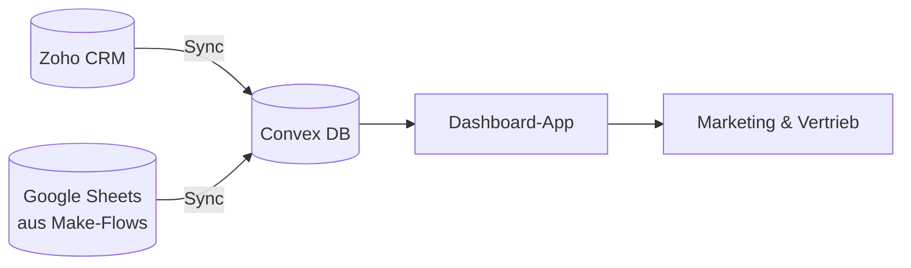

<Callout kind="info">
  **Typ:** Eigene Web-App (Next.js) · **Status:** 🟢 Aktiv · **Quelle:** GitHub `gigagreen-dashboard`
</Callout>

## Zweck

Das Dashboard ist die zentrale Auswertungsoberfläche für Marketing und Vertrieb. Es zieht Leads, Deals und Kosten aus Zoho CRM, verarbeitet sie und zeigt Funnel, Conversion-Pfade, Kanal-Kosten und AE-Performance — als Ablösung des bisherigen Looker-Studio-Berichts.

## Auf einen Blick

| | |
| --- | --- |
| **Tech-Stack** | Next.js (App Router), Convex (Datenhaltung), Recharts |
| **Datenquellen** | Zoho CRM (v2 + v7 API), Google Sheets (über die Make-Reporting-Flows) |
| **Hosting** | Vercel |
| **Zugang** | Passwort-geschützt |
| **Repo** | [github.com/Eddieklickstark/gigagreen-dashboard _(zu bestätigen)_](https://github.com) |

## Aufbau

Das Dashboard ist in zwei Tabs gegliedert:

<Columns cols={2}>
  <Card title="Übersicht" icon="chart-pie">
    Lead- & Opportunity-Funnel, Conversion-Pfade nach Kanal, Kanal-Kosten (CPO / CPMBS) und KPI-Karten.
  </Card>
  <Card title="Vertrieb" icon="users">
    AE-Performance (SQL-, Termin-, Opp-, MBS- und Abschlussquote), Pipeline und inaktive Opportunities.
  </Card>
</Columns>

## Datenfluss

Ein Sync-Skript holt Leads, Deals und History-Zusammenfassungen aus Zoho und legt sie in Convex ab; die App rechnet daraus Funnel, Quoten und Kosten.

## Begriffe

| Begriff | Bedeutung |
| --- | --- |
| **Opp** | Deal / Opportunity in Zoho |
| **MBS** | Deal hat die Stage „Technische Machbarkeit" oder weiter erreicht |
| **CPO / CPMBS** | Kosten pro Opportunity bzw. pro MBS-Opportunity |

<Callout kind="info">
  Detail-Architektur (Sync-Intervalle, Convex-Deployment, Auth-Mechanismus) wird im Bereich Betrieb bzw. direkt im Repo gepflegt — hier bewusst nur der fachliche Überblick. _(Bei Bedarf ergänzen wir Screenshots der Tabs.)_
</Callout>
