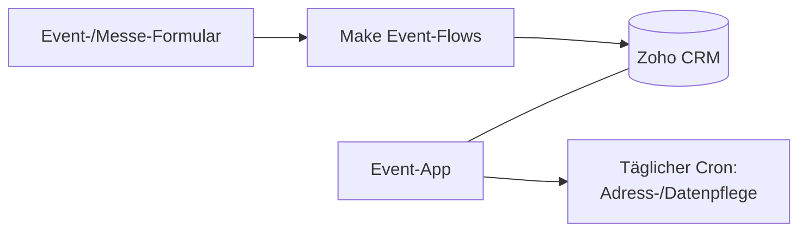

<Callout kind="info">
  **Typ:** Eigene Web-App (Next.js) · **Status:** 🟢 Aktiv · **Quelle:** GitHub `gigagreen-event-app`
</Callout>

## Zweck

Die Event-App unterstützt die Event- und Messe-Arbeit von GIGA.GREEN: Sie verwaltet Teilnehmer-/Kontaktdaten rund um Events und reichert Adressinformationen an. Sie arbeitet mit denselben Event-Daten, die auch die Make-Event-Flows in Zoho schreiben.

## Auf einen Blick

| | |
| --- | --- |
| **Tech-Stack** | Next.js (App Router) |
| **Login** | Magic-Link (Auth.js v5) |
| **Aktualisierung** | Täglicher Cron-Job |
| **Repo** | [github.com/Eddieklickstark/gigagreen-event-app _(zu bestätigen)_](https://github.com) |

## Zusammenspiel mit den Event-Flows

<Callout kind="info">
  Diese Seite ist ein Platzhalter mit dem, was wir sicher wissen. **Bitte ergänze den Kontext:** Was genau leistet die App im Event-Prozess (Anmeldung, Check-in, Nachbearbeitung?), wer nutzt sie, und wo läuft sie (Hosting/Domain)? Dann arbeite ich die Seite vollständig aus.
</Callout>
