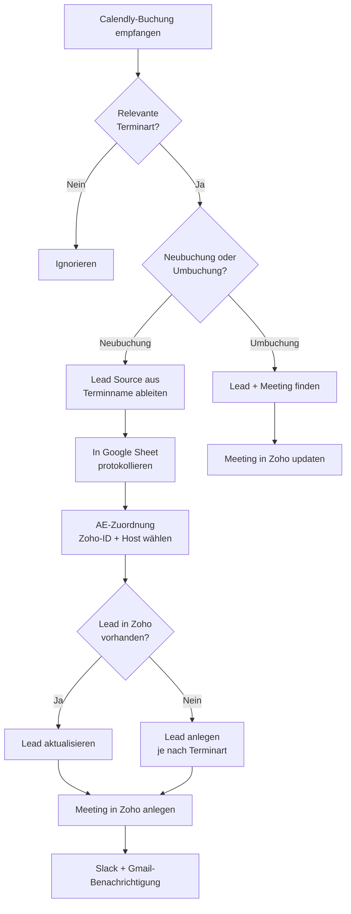

<Callout kind="info">
  **Bereich:** Termine / Calendly · **Status:** 🟢 Aktiv · **Make-ID:** 2149316
</Callout>

## Zweck

Jede neue **Calendly-Buchung** wird automatisch verarbeitet: Der Flow filtert auf relevante Terminarten (Info-, Messe-, Folgetermin, Projektanalyse), unterscheidet zwischen **Neubuchung und Umbuchung**, ordnet den passenden **Account Executive (AE)** zu und legt in Zoho CRM einen Lead sowie ein Meeting an oder aktualisiert bestehende Einträge. Buchungen werden zusätzlich in einem Google Sheet protokolliert.

<Callout kind="warning">
  Dies ist mit **52 Modulen der größte Termin-Flow**. Das Ablaufdiagramm unten zeigt nur den Hauptpfad und die wichtigsten Verzweigungen — der echte Flow enthält zahlreiche verschachtelte Router, Hilfsschritte zur AE-Zuordnung und Spreadsheet-Pflege. Bei Änderungen immer das Make-Szenario direkt betrachten.
</Callout>

## Auf einen Blick

| | |
| --- | --- |
| **Auslöser** | Calendly — neue/geänderte Buchung (watchInvitees) |
| **Häufigkeit** | Sofort bei jeder Buchung (Echtzeit) |
| **Verknüpfte Tools** | Calendly, Google Sheets, Zoho CRM, Slack, Gmail |
| **Schreibt nach** | Zoho CRM (Lead + Meeting), Google Sheets, Slack |
| **Wo zu finden** | [Make-Szenario öffnen ↗](https://eu2.make.com/548585/scenarios/2149316/edit) |

## Ablauf

<Steps>
  <Step title="Buchung empfangen & Terminart filtern">
    Calendly meldet eine Buchung. Der Flow lässt nur relevante Terminarten durch: **Informationstermin** (diverse Schreibweisen, inkl. „Info Call", „Infotermin", „Informationstermin Vor-Ort"), **Messetermin**, **Folgetermin** und **Projektanalyse**. Andere Termine werden ignoriert.
  </Step>
  <Step title="Neubuchung vs. Umbuchung">
    Über das Feld `old_invitee` entscheidet der Flow:
    - **fehlt** → es ist eine **Neubuchung**
    - **vorhanden** → es ist eine **Umbuchung / Terminänderung**
  </Step>
  <Step title="Neubuchung — Quelle & Protokoll">
    Bei einer Neubuchung wird die **Lead Source aus dem Terminnamen** abgeleitet (bei Messeterminen das richtige Event gewählt) und die Buchung in einem **Google Sheet** protokolliert. **Test-Buchungen** (Name enthält „test", E-Mail enthält „test" oder „giga.green") werden nicht gespeichert.
  </Step>
  <Step title="AE zuordnen">
    Der Flow ermittelt die **Zoho-ID des Account Executive** aus dem Sheet, setzt den `partner@`-User als Fallback und wählt den **richtigen Meeting-Host**.
  </Step>
  <Step title="Lead anlegen oder aktualisieren">
    Existiert der Lead schon, wird er **aktualisiert**. Sonst wird je nach Terminart ein neuer Lead angelegt — unterschieden in **AddSales-Infotermin**, **Messetermin** und **regulären Neukunden-Lead**. Anschließend folgen **Slack-** und **Gmail-Benachrichtigung**.
  </Step>
  <Step title="Meeting erstellen">
    Zum Lead wird ein **Meeting in Zoho CRM** angelegt (bei Projektanalyse/Folgetermin wird der zugehörige Lead vorher gesucht).
  </Step>
  <Step title="Umbuchung">
    Bei einer Terminänderung sucht der Flow den **bestehenden Lead und das bestehende Meeting** und **aktualisiert das Meeting** in Zoho, statt etwas Neues anzulegen.
  </Step>
</Steps>

## Daten

| Rein | Raus |
| --- | --- |
| Calendly-Buchung: Terminart/Event-Name, Invitee (Name, E-Mail), Event-URI, `old_invitee`, Lead Source aus Terminname | Zoho-Lead (neu oder aktualisiert), Zoho-Meeting, Google-Sheet-Zeile, Slack-Nachricht, Gmail-Benachrichtigung |

## Wichtige Regeln

<Callout kind="info">
  **Nur bestimmte Terminarten:** Verarbeitet werden ausschließlich Informationstermine (alle Schreibvarianten), Messetermine, Folgetermine und Projektanalysen. Alle anderen Calendly-Buchungen werden verworfen.
</Callout>

<Callout kind="info">
  **Test-Buchungen werden nicht gespeichert:** Enthält der Name „test" oder die E-Mail „test" bzw. „giga.green", wird die Buchung nicht ins Google Sheet geschrieben.
</Callout>

## Fehlerfälle

| Symptom | Mögliche Ursache | Erste Maßnahme |
| --- | --- | --- |
| Buchung wird nicht verarbeitet | Terminart entspricht keinem der erlaubten Namen | Schreibweise des Calendly-Event-Namens gegen den Terminart-Filter prüfen |
| Lead doppelt angelegt | Dublettensuche in Zoho greift nicht oder AE-Zuordnung schlägt fehl | Letzte Ausführung im Make-Szenario prüfen, Zoho-Suche kontrollieren |
| Falscher oder kein AE als Host | AE-Zoho-ID nicht im Google Sheet gefunden | Sheet mit AE-Zuordnung aktualisieren, `partner@`-Fallback prüfen |
| Umbuchung legt neues Meeting an statt zu aktualisieren | `old_invitee` nicht erkannt oder Meeting nicht gefunden | Calendly-Webhook-Daten und Meeting-Suche in Zoho prüfen |
| Keine Slack-/Gmail-Meldung | Slack- oder Gmail-Verbindung getrennt | Connection in Make neu autorisieren |
