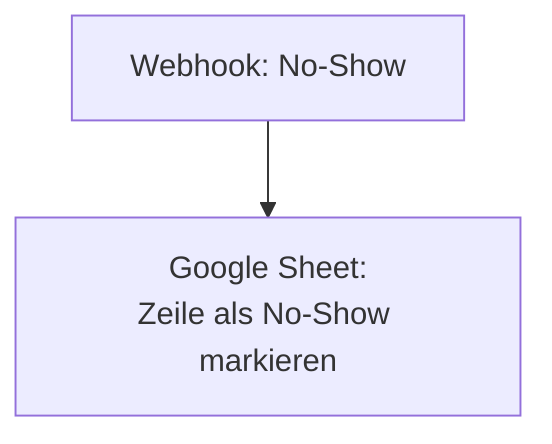

<Callout kind="info">
  **Bereich:** Termine und Calendly · **Status:** Aktiv · **Make-ID:** 6295861
</Callout>

## Verwendete Tools

`Google Sheets`

## In a nutshell

Erscheint jemand nicht zum Termin, kommt ein **Webhook** rein und dieser Flow markiert den Termin in der **Liste im Google Sheet** als **No-Show**. Zwei Schritte, mehr nicht.

## Ablauf

## Auf einen Blick

- **Auslöser:** Webhook
- **Häufigkeit:** Sofort, sobald ein No-Show gemeldet wird (Echtzeit)
- **Schreibt nach:** Google Sheets (Zeile aktualisieren)
- **Wo zu finden:** [Make-Szenario öffnen ↗](https://eu2.make.com/548585/scenarios/6295861/edit)

## Im Detail

<Steps>
  <Step title="No-Show empfangen">
    Ein Webhook signalisiert, dass ein Termin nicht wahrgenommen wurde.
  </Step>
  <Step title="Im Sheet markieren">
    Die zugehörige **Zeile im Google Sheet** wird aktualisiert und als No-Show markiert.
  </Step>
</Steps>

### Daten

| Rein | Raus |
| --- | --- |
| No-Show-Webhook (kennzeichnet Termin und Zeile) | Aktualisierte Zeile im Google Sheet |

### Fehlerfälle

| Symptom | Mögliche Ursache | Erste Maßnahme |
| --- | --- | --- |
| Zeile wird nicht markiert | Zeile im Sheet nicht gefunden oder Webhook nicht ausgelöst | Letzte Ausführung im Make-Szenario prüfen, Zeilen-Match kontrollieren |
| Google-Sheets-Verbindung abgelaufen | Connection getrennt | Verbindung in Make neu autorisieren |
