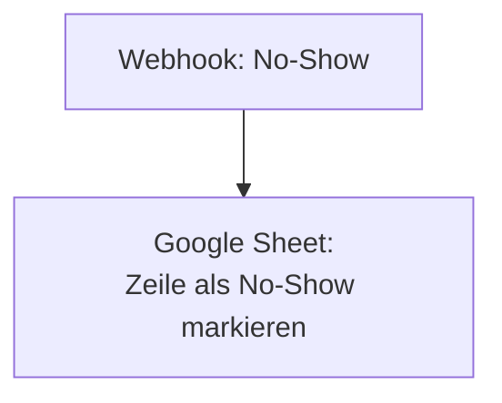

<Callout kind="info">
  **Bereich:** Termine / Calendly · **Status:** 🟢 Aktiv · **Make-ID:** 6295861
</Callout>

## Verwendete Tools

`Google Sheets`

## In a nutshell

Ein eingehender **Webhook** markiert einen Termin als **No-Show** (nicht erschienen) in der zugehörigen **Google-Sheet-Liste**. Sehr schlanker Flow aus nur zwei Schritten.

## Ablauf

## Auf einen Blick

| | |
| --- | --- |
| **Auslöser** | Webhook |
| **Häufigkeit** | Sofort bei No-Show-Meldung (Echtzeit) |
| **Schreibt nach** | Google Sheets (Zeile aktualisieren) |
| **Wo zu finden** | [Make-Szenario öffnen ↗](https://eu2.make.com/548585/scenarios/6295861/edit) |

## Im Detail

<Steps>
  <Step title="No-Show empfangen">
    Ein Webhook signalisiert, dass ein Termin nicht wahrgenommen wurde.
  </Step>
  <Step title="Im Sheet markieren">
    Die zugehörige **Zeile im Google Sheet** wird aktualisiert und als No-Show markiert.
  </Step>
</Steps>

### Daten

| Rein | Raus |
| --- | --- |
| No-Show-Webhook (Termin-/Zeilen-Identifikation) | Aktualisierte Zeile im Google Sheet |

### Fehlerfälle

| Symptom | Mögliche Ursache | Erste Maßnahme |
| --- | --- | --- |
| Zeile wird nicht markiert | Zeile im Sheet nicht gefunden oder Webhook nicht ausgelöst | Letzte Ausführung im Make-Szenario prüfen, Zeilen-Match kontrollieren |
| Google-Sheets-Verbindung abgelaufen | Connection getrennt | Verbindung in Make neu autorisieren |
