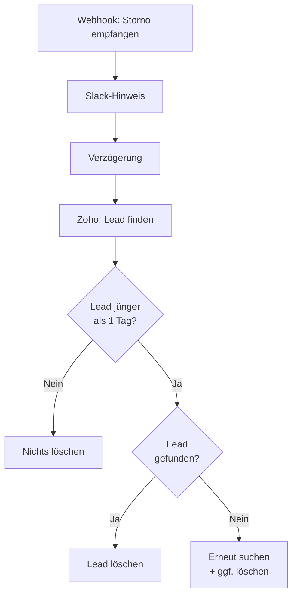

<Callout kind="info">
  **Bereich:** Termine / Calendly · **Status:** Aktiv · **Make-ID:** 5179280
</Callout>

## Verwendete Tools

`Zoho CRM` `Slack`

## In a nutshell

Wird ein AddSales-Termin über Calendly **storniert**, entfernt dieser Flow den dadurch fälschlich angelegten **Fehl-Lead** in Zoho CRM — aber nur, wenn der Lead **jünger als ein Tag** ist (also durch genau diese Buchung entstanden). Das Team wird per **Slack** über die Conversion-Stornierung informiert.

<Callout kind="warning">
  **Dieser Flow löscht Daten in Zoho CRM.** Es werden Leads per `DeleteObject` entfernt. Die Sicherung dagegen ist allein der Altersfilter (jünger als 1 Tag) — greift dieser nicht korrekt, könnte ein bestehender Lead gelöscht werden. Änderungen am Filter mit besonderer Vorsicht vornehmen.
</Callout>

## Ablauf

## Auf einen Blick

- **Auslöser:** Webhook — Storno-E-Mail empfangen
- **Häufigkeit:** Sofort bei jeder Stornierung (Echtzeit)
- **Schreibt nach:** Zoho CRM (Lead löschen), Slack
- **Wo zu finden:** [Make-Szenario öffnen ↗](https://eu2.make.com/548585/scenarios/5179280/edit)

## Im Detail

<Steps>
  <Step title="Storno empfangen">
    Ein Webhook empfängt die **Storno-E-Mail** der Calendly-Buchung und es geht eine **Slack-Meldung** raus.
  </Step>
  <Step title="Verzögern & Lead suchen">
    Nach einer kurzen **Verzögerung** sucht der Flow den zugehörigen **Lead in Zoho CRM**.
  </Step>
  <Step title="Altersprüfung">
    Es wird nur weitergemacht, wenn das **Erstellungsdatum des Leads jünger als ein Tag** ist (`Created_Date_Custom` > heute − 1 Tag). Damit werden nur frisch durch die stornierte Buchung entstandene Fehl-Leads getroffen.
  </Step>
  <Step title="Lead löschen">
    Ist der Lead vorhanden, wird er **gelöscht**. Wird beim ersten Versuch keiner gefunden, sucht der Flow gestaffelt erneut und löscht den Treffer.
  </Step>
</Steps>

### Daten

| Rein | Raus |
| --- | --- |
| Storno-Webhook (Lead-Identifikation, Buchungsdaten) | Gelöschter Zoho-Lead (falls jünger als 1 Tag), Slack-Nachricht |

### Wichtige Regeln

<Callout kind="warning">
  **Nur Leads jünger als 1 Tag werden gelöscht.** Filter: `Created_Date_Custom` muss nach `heute − 1 Tag` liegen. Dieser Altersfilter ist die einzige Absicherung gegen das versehentliche Löschen eines echten Bestands-Leads.
</Callout>

### Fehlerfälle

| Symptom | Mögliche Ursache | Erste Maßnahme |
| --- | --- | --- |
| Fehl-Lead bleibt bestehen | Lead älter als 1 Tag oder bei Suche nicht gefunden | Erstellungsdatum prüfen, Zoho-Suche im Szenario kontrollieren |
| Echter Lead versehentlich gelöscht | Altersfilter zu weit gefasst oder Datumsfeld falsch | Sofort Filter `Created_Date_Custom` prüfen, Lead in Zoho wiederherstellen |
| Keine Slack-Meldung | Slack-Verbindung getrennt | Slack-Connection in Make neu verbinden |
| Storno wird nicht verarbeitet | Webhook nicht ausgelöst | Letzte Ausführung im Make-Szenario prüfen |
