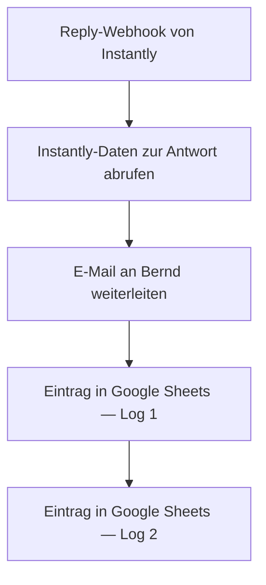

<Callout kind="info">
  **Bereich:** Cold-E-Mail & Sonstiges · **Status:** 🟢 Aktiv · **Make-ID:** 1995270
</Callout>

## Verwendete Tools

`Instantly` `E-Mail (IMAP/SMTP)` `Google Sheets`

## In a nutshell

Antwortet ein Empfänger auf eine **Cold-Mail-Kampagne in Instantly**, meldet Instantly das per Webhook an Make. Der Flow leitet die Antwort **per E-Mail an Bernd** weiter, damit sie nicht untergeht, und schreibt sie zur Nachverfolgung in **zwei Google-Sheets-Logs**.

## Ablauf

## Auf einen Blick

| | |
| --- | --- |
| **Auslöser** | Webhook — Reply-Ereignis aus Instantly |
| **Häufigkeit** | Sofort bei jeder eingehenden Antwort (Echtzeit) |
| **Schreibt nach** | E-Mail an Bernd, Google Sheets (zwei Log-Einträge) |
| **Wo zu finden** | [Make-Szenario öffnen ↗](https://eu2.make.com/548585/scenarios/1995270/edit) |

## Im Detail

<Steps>
  <Step title="Antwort empfangen">
    Instantly schickt per **Webhook** ein Reply-Ereignis an Make, sobald ein Empfänger auf eine Cold-Mail antwortet.
  </Step>
  <Step title="Instantly-Daten abrufen">
    Über das **Instantly-Modul** werden die Details zur Antwort geladen.
  </Step>
  <Step title="An Bernd weiterleiten">
    Die Antwort wird **per E-Mail an Bernd** weitergeleitet.
  </Step>
  <Step title="Protokollieren">
    Die Antwort wird in **zwei Google-Sheets-Zeilen** als Log abgelegt.
  </Step>
</Steps>

### Daten

| Rein | Raus |
| --- | --- |
| Reply-Daten aus Instantly (Absender, Nachricht, Kampagne) | Weiterleitungs-E-Mail an Bernd, zwei Google-Sheets-Log-Einträge |

### Fehlerfälle

| Symptom | Mögliche Ursache | Erste Maßnahme |
| --- | --- | --- |
| Bernd erhält keine Weiterleitung | Webhook nicht ausgelöst oder SMTP-Verbindung abgelaufen | Im Make-Szenario die letzte Ausführung prüfen, E-Mail-Connection neu autorisieren |
| Keine Instantly-Daten | Instantly-Verbindung getrennt | Instantly-Connection in Make neu verbinden |
| Antwort fehlt im Google Sheet | Google-Sheets-Verbindung defekt oder Zielblatt verschoben | Sheet-Connection prüfen, Ziel-Tabelle/Blatt im addRow-Modul kontrollieren |
