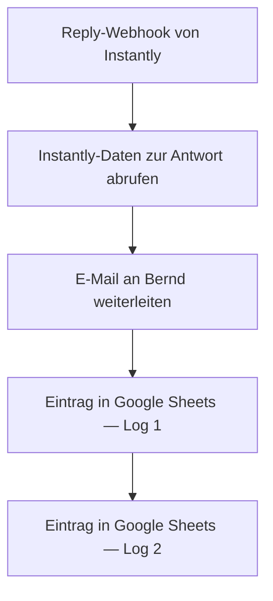

<Callout kind="info">
  **Bereich:** Cold Mail und Sonstiges · **Status:** Aktiv · **Make-ID:** 1995270
</Callout>

## Verwendete Tools

`Instantly` `E-Mail` `Google Sheets`

## In a nutshell

Antwortet jemand auf eine **Cold Mail in Instantly**, meldet Instantly das per Webhook an Make. Dieser Flow leitet die Antwort **per E-Mail an Bernd** weiter, damit sie nicht untergeht, und schreibt sie in **zwei Logs in Google Sheets** mit.

## Ablauf

## Auf einen Blick

- **Auslöser:** Webhook mit dem Reply-Ereignis aus Instantly
- **Häufigkeit:** Sofort bei jeder eingehenden Antwort, also in Echtzeit
- **Schreibt nach:** E-Mail an Bernd und zwei Log-Einträge in Google Sheets
- **Wo zu finden:** [Make-Szenario öffnen ↗](https://eu2.make.com/548585/scenarios/1995270/edit)

## Im Detail

<Steps>
  <Step title="Antwort empfangen">
    Instantly schickt per **Webhook** ein Reply-Ereignis an Make, sobald ein Empfänger auf eine Cold Mail antwortet.
  </Step>
  <Step title="Instantly-Daten abrufen">
    Über das **Instantly-Modul** werden die Details zur Antwort geladen.
  </Step>
  <Step title="An Bernd weiterleiten">
    Die Antwort wird **per E-Mail an Bernd** weitergeleitet.
  </Step>
  <Step title="Protokollieren">
    Die Antwort wird als Log in **zwei Zeilen in Google Sheets** abgelegt.
  </Step>
</Steps>

### Daten

| Rein | Raus |
| --- | --- |
| Reply-Daten aus Instantly mit Absender, Nachricht und Kampagne | eine Weiterleitung per E-Mail an Bernd und zwei Log-Einträge in Google Sheets |

### Fehlerfälle

| Symptom | Mögliche Ursache | Erste Maßnahme |
| --- | --- | --- |
| Bernd erhält keine Weiterleitung | Webhook nicht ausgelöst oder die SMTP-Verbindung abgelaufen | Im Make-Szenario die letzte Ausführung prüfen und die E-Mail-Connection neu autorisieren |
| Keine Instantly-Daten | Instantly-Verbindung getrennt | Instantly-Connection in Make neu verbinden |
| Antwort fehlt im Google Sheet | Google-Sheets-Verbindung defekt oder das Zielblatt verschoben | Sheet-Connection prüfen und im addRow-Modul kontrollieren, ob Tabelle und Blatt stimmen |
