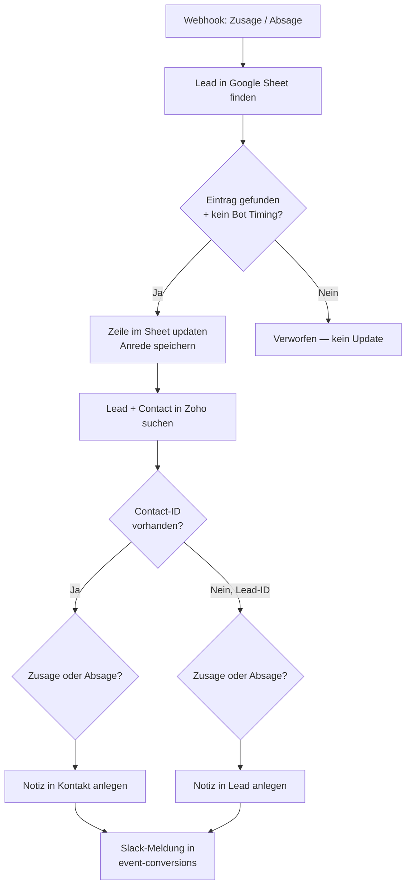

<Callout kind="info">
  **Bereich:** Events · **Status:** 🟢 Aktiv · **Make-ID:** 9270028
</Callout>

## Zweck

Antwortet ein Eingeladener mit **Zusage** oder **Absage**, verarbeitet dieser Flow die Rückmeldung: Er aktualisiert den Eintrag in der **Google-Sheet-Liste**, hinterlegt eine **Notiz** am zugehörigen **Lead oder Kontakt** in Zoho und postet eine **Benachrichtigung in Slack**. Eine Timing-Prüfung filtert automatisierte Bot-Klicks heraus.

## Auf einen Blick

| | |
| --- | --- |
| **Auslöser** | Webhook — Zu-/Absage auf eine Event-Einladung |
| **Häufigkeit** | Sofort bei jeder Antwort (Echtzeit) |
| **Verknüpfte Tools** | Google Sheets, Zoho CRM, Slack |
| **Schreibt nach** | Google Sheets (Status-Update), Zoho CRM (Notiz an Lead/Kontakt), Slack |
| **Wo zu finden** | [Make-Szenario öffnen ↗](https://eu2.make.com/548585/scenarios/9270028/edit) |

## Ablauf

<Steps>
  <Step title="Antwort empfangen">
    Eine **Zu- oder Absage** kommt per Webhook an. Das Feld `status` enthält den Wert `zusage` oder `absage`.
  </Step>
  <Step title="Eintrag finden & Bot-Prüfung">
    Der passende Eintrag wird in der **Google-Sheet-Liste** gesucht. Nur wenn ein Eintrag gefunden wurde **und** die Timing-Prüfung (`__ROW_NUMBER__` vorhanden) besteht, geht es weiter — so werden automatisierte Bot-Klicks aussortiert.
  </Step>
  <Step title="Sheet aktualisieren">
    Die gefundene Zeile wird mit dem neuen Status **aktualisiert** und die Anrede für die spätere Notiz zwischengespeichert.
  </Step>
  <Step title="Lead bzw. Kontakt in Zoho finden">
    Der Flow sucht in Zoho nach **Lead** und **Contact**.
    - **Contact vorhanden** → die Notiz wird am **Kontakt** angelegt.
    - **nur Lead vorhanden** → die Notiz wird am **Lead** angelegt.

    Der Notiz-Text richtet sich danach, ob es eine **Zusage** oder **Absage** war.
  </Step>
  <Step title="Slack-Meldung">
    Zum Abschluss wird eine Benachrichtigung im Kanal **event-conversions** gepostet.
  </Step>
</Steps>

## Daten

| Rein | Raus |
| --- | --- |
| `status` (zusage/absage), Antwortdaten zur Event-Einladung | Aktualisierte Sheet-Zeile, Notiz an Zoho-Lead oder -Kontakt, Slack-Meldung in `event-conversions` |

## Wichtige Regeln

<Callout kind="warning">
  **Bot-Schutz über Timing:** Der Flow verarbeitet eine Antwort nur, wenn der Eintrag im Sheet gefunden wurde und die Prüfung `__ROW_NUMBER__` vorhanden ist. Damit werden automatisierte Klicks (z. B. von Mail-Scannern) herausgefiltert, die unmittelbar nach dem Versand auslösen.
</Callout>

<Callout kind="info">
  **Notiz-Ziel hängt vom Datensatz ab:** Existiert ein Contact, wird die Notiz am Kontakt hinterlegt, sonst am Lead. Der Inhalt der Notiz unterscheidet zwischen Zusage und Absage.
</Callout>

## Fehlerfälle

| Symptom | Mögliche Ursache | Erste Maßnahme |
| --- | --- | --- |
| Antwort wird ignoriert | Timing-Prüfung hat angeschlagen (Bot-Verdacht) oder Eintrag im Sheet nicht gefunden | Prüfen, ob die Zeile zur Antwort existiert; bei echten Antworten Timing/`__ROW_NUMBER__`-Logik kontrollieren |
| Keine Notiz in Zoho | Weder Contact- noch Lead-ID gefunden | In Zoho prüfen, ob Lead/Kontakt zur Antwort existiert |
| Status im Sheet nicht aktualisiert | Eintrag nicht gefunden oder Sheet-Verbindung defekt | Google-Sheets-Verbindung und Suchkriterien prüfen |
| Keine Slack-Meldung | Slack-Verbindung getrennt | Slack-Connection in Make neu verbinden |
