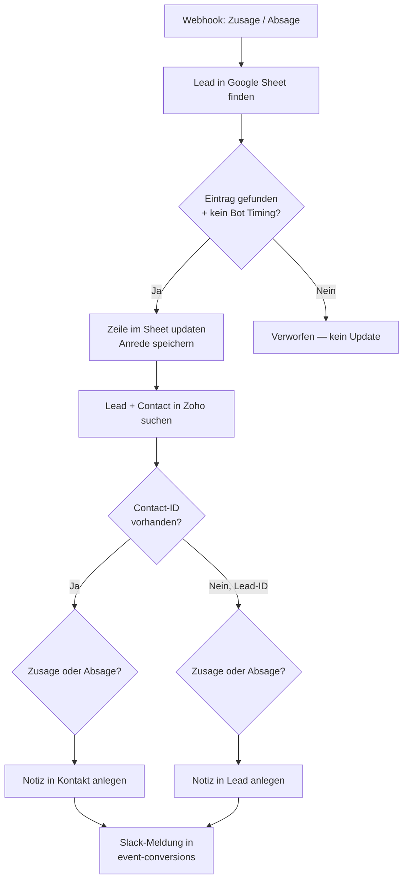

<Callout kind="info">
  **Bereich:** Events · **Status:** Aktiv · **Make-ID:** 9270028
</Callout>

## Verwendete Tools

`Google Sheets` `Zoho CRM` `Slack`

## In a nutshell

Sagt ein Eingeladener **zu oder ab**, trägt dieser Flow die Antwort in die **Google-Sheet-Liste** ein, hinterlegt eine **Notiz** am passenden **Lead oder Kontakt** in Zoho und meldet das in **Slack**. Eine Timing-Prüfung wirft automatische Bot-Klicks vorher raus.

## Ablauf

## Auf einen Blick

- **Auslöser:** Webhook bei Zusage oder Absage auf eine Event-Einladung
- **Häufigkeit:** Sofort bei jeder Antwort (Echtzeit)
- **Schreibt nach:** Google Sheets (Status-Update), Zoho CRM (Notiz an Lead oder Kontakt), Slack
- **Absender:** die Event-App. Sie prüft jede Antwort vorab mit einem Bot-Scoring (Mehrfach-Signale statt reinem Timing) und sendet erst danach den Webhook mit `status`, `vorname`, `nachname`, `invite_method` und `clicked_at`.
- **Wo zu finden:** [Make-Szenario öffnen ↗](https://eu2.make.com/548585/scenarios/9270028/edit)

## Im Detail

<Steps>
  <Step title="Antwort empfangen">
    Eine **Zu- oder Absage** kommt per Webhook an. Das Feld `status` enthält den Wert `zusage` oder `absage`.
  </Step>
  <Step title="Eintrag finden und Bot-Prüfung">
    Der passende Eintrag wird in der **Google-Sheet-Liste** gesucht. Nur wenn ein Eintrag gefunden wurde **und** die Timing-Prüfung (`__ROW_NUMBER__` vorhanden) besteht, geht es weiter. So werden automatisierte Bot-Klicks aussortiert.
  </Step>
  <Step title="Sheet aktualisieren">
    Die gefundene Zeile wird mit dem neuen Status **aktualisiert** und die Anrede für die spätere Notiz zwischengespeichert.
  </Step>
  <Step title="Lead bzw. Kontakt in Zoho finden">
    Der Flow sucht in Zoho nach **Lead** und **Contact**.
    - **Contact vorhanden** → die Notiz wird am **Kontakt** angelegt.
    - **nur Lead vorhanden** → die Notiz wird am **Lead** angelegt.

    Der Notiz-Text richtet sich danach, ob es eine **Zusage** oder **Absage** war.
  </Step>
  <Step title="Slack-Meldung">
    Zum Abschluss wird eine Benachrichtigung im Kanal **event-conversions** gepostet. Seit August 2026 steht über der E-Mail-Zeile eine Gast-Zeile mit dem vollen Namen aus dem Payload; fehlt der Name, entfällt die Zeile. Der Zeitstempel zeigt den echten Antwort-Zeitpunkt (`clicked_at`), nicht den Verarbeitungszeitpunkt, damit Nachzügler aus der Queue korrekt datiert sind.
  </Step>
</Steps>

### Daten

| Rein | Raus |
| --- | --- |
| `status` (zusage oder absage), Antwortdaten zur Event-Einladung | Aktualisierte Sheet-Zeile, Notiz am Zoho-Lead oder am Kontakt, Slack-Meldung in `event-conversions` |

### Wichtige Regeln

<Callout kind="warning">
  **Bot-Schutz über Timing:** Der Flow verarbeitet eine Antwort nur, wenn der Eintrag im Sheet gefunden wurde und die Prüfung `__ROW_NUMBER__` vorhanden ist. Damit werden automatisierte Klicks (z. B. von Mail-Scannern) herausgefiltert, die unmittelbar nach dem Versand auslösen.
</Callout>

<Callout kind="info">
  **Notiz-Ziel hängt vom Datensatz ab:** Existiert ein Contact, wird die Notiz am Kontakt hinterlegt, sonst am Lead. Der Inhalt der Notiz unterscheidet zwischen Zusage und Absage.
</Callout>

### Fehlerfälle

| Symptom | Mögliche Ursache | Erste Maßnahme |
| --- | --- | --- |
| Antwort wird ignoriert | Timing-Prüfung hat angeschlagen (Bot-Verdacht) oder Eintrag im Sheet nicht gefunden | Prüfen, ob die Zeile zur Antwort existiert; bei echten Antworten die Logik um Timing und `__ROW_NUMBER__` kontrollieren |
| Keine Notiz in Zoho | Weder Contact- noch Lead-ID gefunden | In Zoho prüfen, ob ein Lead oder Kontakt zur Antwort existiert |
| Status im Sheet nicht aktualisiert | Eintrag nicht gefunden oder Sheet-Verbindung defekt | Google-Sheets-Verbindung und Suchkriterien prüfen |
| Keine Slack-Meldung | Slack-Verbindung getrennt | Slack-Connection in Make neu verbinden |
