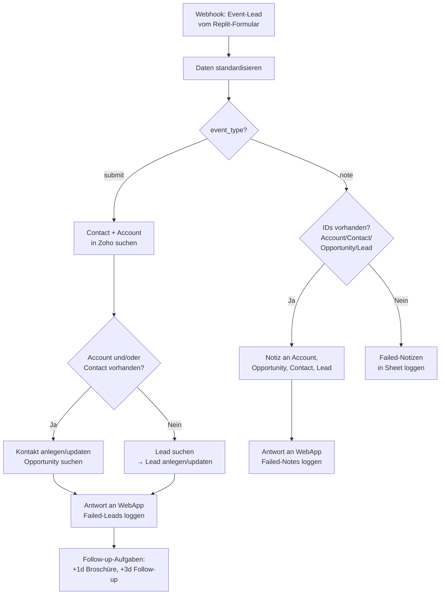

<Callout kind="info">
  **Bereich:** Events · **Status:** Aktiv · **Make-ID:** 7102488
</Callout>

## Verwendete Tools

`Zoho CRM` `Google Sheets` `HTTP (WebApp-Antwort)`

## In a nutshell

Dieser Flow ist die zentrale Schnittstelle zwischen dem **Event-Formular auf der Messe-WebApp (Replit)** und Zoho CRM. Er entscheidet, ob zu einem Messe-Lead bereits ein Kontakt, Account, eine Opportunity oder ein Lead in Zoho existiert, und legt diese an oder aktualisiert sie entsprechend. Zusätzlich plant er Follow-up-Aufgaben, protokolliert fehlgeschlagene Datensätze und schickt eine Antwort an die WebApp zurück.

<Callout kind="warning">
  **Größter und komplexester Flow im Event-System (64 Module).** Das Diagramm unten ist bewusst stark vereinfacht und zeigt nur die beiden Hauptpfade. Vor Änderungen immer das Make-Szenario direkt prüfen — die Verzweigungslogik (verschachtelte Router, Failed-Logging je Zweig) ist im Detail deutlich umfangreicher.
</Callout>

## Ablauf

Der Flow verzweigt direkt nach dem Empfang anhand des Feldes `event_type` in zwei Hauptpfade: **submit** (neue Lead-Übermittlung vom Formular) und **note** (nachträgliche Notiz zu einem bereits bekannten Datensatz).

## Auf einen Blick

- **Auslöser:** Webhook — Event-Formular der Messe-WebApp (Replit)
- **Häufigkeit:** Sofort bei jeder Übermittlung (Echtzeit)
- **Schreibt nach:** Zoho CRM (Contact, Account, Opportunity, Lead, Notizen, Aufgaben), Google Sheets (Failed-Logs), WebApp (HTTP-Response)
- **Wo zu finden:** [Make-Szenario öffnen ↗](https://eu2.make.com/548585/scenarios/7102488/edit)

## Im Detail

<Steps>
  <Step title="Daten empfangen & standardisieren">
    Die WebApp schickt die Formulardaten per Webhook. Die Werte werden zunächst **standardisiert** (vereinheitlicht aufbereitet).
  </Step>
  <Step title="Webhook-Typ unterscheiden">
    Der Flow liest `event_type`:
    - **submit** → es handelt sich um eine neue Lead-Übermittlung vom Formular
    - **note** → es soll eine Notiz zu einem schon bekannten Datensatz ergänzt werden
  </Step>
  <Step title="submit — Contact & Account abgleichen">
    Bei `submit` sucht der Flow in Zoho nach **Contact** und **Account**.
    - **Account und/oder Contact vorhanden** → Opportunities werden gesucht, der Kontakt wird aktualisiert (oder neu angelegt, falls kein Contact existiert).
    - **Account und Contact nicht vorhanden** → der Flow sucht stattdessen nach einem **Lead** und legt ihn an oder aktualisiert ihn.
  </Step>
  <Step title="submit — Antwort, Fehler-Logging & Aufgaben">
    Lief alles fehlerfrei, geht eine **Antwort an die WebApp** zurück. Bei Fehlern wird der Datensatz in die **Failed-Leads-Liste** (Google Sheets) geschrieben. Abhängig von den Formular-Flags werden Follow-up-Aufgaben in Zoho geplant:
    - **+1 Tag** — „Broschüre zusenden" (wenn `lead_material_whitepaper` = true)
    - **+3 Tage** — „nach Event Follow Up" (wenn `lead_follow_up` = true)
  </Step>
  <Step title="note — Notizen ergänzen">
    Bei `event_type = note` prüft der Flow, ob **Account-, Contact-, Opportunity- und Lead-ID** vorliegen. Falls ja, wird je vorhandener ID eine **Notiz** am entsprechenden Datensatz angelegt und eine Antwort an die WebApp geschickt. Fehlt eine der IDs, landet der Datensatz in der **Failed-Notizen-Liste**.
  </Step>
</Steps>

### Daten

| Rein | Raus |
| --- | --- |
| `event_type` (submit/note), Lead-/Kontaktdaten vom Event-Formular, Flags `lead_material_whitepaper` und `lead_follow_up`, Zoho-IDs (`zoho_account_id`, `zoho_contact_id`, `zoho_opportunity_id`, `zoho_lead_id`) | Zoho-Contact, -Account, -Opportunity oder -Lead (angelegt/aktualisiert), Zoho-Notizen, Follow-up-Aufgaben, HTTP-Antwort an die WebApp, Failed-Leads-/Failed-Notizen-Einträge im Sheet |

### Wichtige Regeln

<Callout kind="info">
  **submit vs. note:** Das Feld `event_type` steuert den gesamten Flow. „submit" verarbeitet eine komplette Lead-Übermittlung inklusive Anlage/Update und Aufgaben, „note" ergänzt ausschließlich Notizen an bereits in Zoho existierende Datensätze.
</Callout>

<Callout kind="info">
  **Follow-up-Aufgaben sind optional:** Sie werden nur erzeugt, wenn die entsprechenden Formular-Flags gesetzt sind — `lead_material_whitepaper = true` für die Broschüren-Aufgabe (+1d) und `lead_follow_up = true` für die Follow-up-Aufgabe (+3d).
</Callout>

### Fehlerfälle

| Symptom | Mögliche Ursache | Erste Maßnahme |
| --- | --- | --- |
| Lead taucht in Zoho nicht auf | Webhook nicht ausgelöst oder Zoho-Verbindung abgelaufen | Letzte Ausführung im Make-Szenario prüfen, Zoho-Connection neu autorisieren |
| Eintrag in „Failed Leads"-Sheet | Anlage/Update in Zoho ist fehlgeschlagen (Status-Code-Fehler) | Betroffenen Datensatz im Sheet prüfen, Zoho-Felder/Verbindung kontrollieren, ggf. erneut auslösen |
| Notiz wird nicht angelegt | Bei `note` fehlt eine der benötigten IDs (Account/Contact/Opportunity/Lead) | „Failed Notizen"-Sheet prüfen — die WebApp muss alle IDs mitliefern |
| WebApp erhält keine Antwort | HTTP-Modul „Response an WebApp" wurde wegen vorherigem Fehler übersprungen | Failed-Logs prüfen; sobald der eigentliche Zoho-Fehler behoben ist, läuft die Antwort wieder |
| Keine Follow-up-Aufgabe | Formular-Flag nicht gesetzt | Prüfen, ob `lead_material_whitepaper` bzw. `lead_follow_up` vom Formular auf `true` gesendet wurde |
