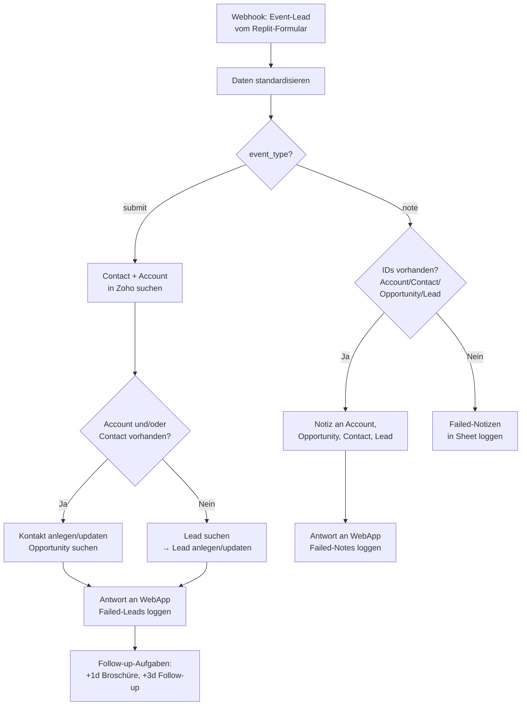

<Callout kind="info">
  **Bereich:** Events · **Status:** Aktiv · **Make-ID:** 7102488
</Callout>

## Verwendete Tools

`Zoho CRM` `Google Sheets` `HTTP`

## In a nutshell

Dieser Flow verbindet das **Messe-Formular (Replit)** mit **Zoho CRM**. Er schaut, ob es zum Messe-Lead schon einen Kontakt, Account, eine Opportunity oder einen Lead gibt, und legt sie an oder aktualisiert sie. Dazu plant er die Aufgaben fürs Follow-up, protokolliert fehlgeschlagene Datensätze und schickt eine Antwort an die WebApp zurück.

<Callout kind="warning">
  **Größter und aufwendigster Flow im Event-System (64 Module).** Das Diagramm unten ist bewusst stark vereinfacht und zeigt nur die beiden Hauptpfade. Vor Änderungen immer das Make-Szenario direkt prüfen, denn die Verzweigungslogik mit ihren verschachtelten Routern und dem Logging fehlgeschlagener Datensätze je Zweig ist im Detail deutlich umfangreicher.
</Callout>

## Ablauf

Der Flow verzweigt direkt nach dem Empfang anhand des Feldes `event_type` in zwei Hauptpfade: **submit** (eine neue Lead-Übermittlung vom Formular) und **note** (eine nachträgliche Notiz zu einem bereits bekannten Datensatz).

## Auf einen Blick

- **Auslöser:** Webhook vom Event-Formular der Messe-WebApp (Replit)
- **Häufigkeit:** Sofort bei jeder Übermittlung (Echtzeit)
- **Schreibt nach:** Zoho CRM (Contact, Account, Opportunity, Lead, Notizen, Aufgaben), Google Sheets (Logs fehlgeschlagener Datensätze), WebApp (HTTP-Response)
- **Wo zu finden:** [Make-Szenario öffnen ↗](https://eu2.make.com/548585/scenarios/7102488/edit)

## Im Detail

<Steps>
  <Step title="Daten empfangen und standardisieren">
    Die WebApp schickt die Formulardaten per Webhook. Die Werte werden zunächst **standardisiert** (vereinheitlicht aufbereitet).
  </Step>
  <Step title="Webhook-Typ unterscheiden">
    Der Flow liest `event_type`:
    - **submit** → es handelt sich um eine neue Lead-Übermittlung vom Formular
    - **note** → es soll eine Notiz zu einem schon bekannten Datensatz ergänzt werden
  </Step>
  <Step title="submit: Contact und Account abgleichen">
    Bei `submit` sucht der Flow in Zoho nach **Contact** und **Account**.
    - **Account oder Contact vorhanden** → Opportunities werden gesucht, der Kontakt wird aktualisiert (oder neu angelegt, falls kein Contact existiert).
    - **Account und Contact nicht vorhanden** → der Flow sucht stattdessen nach einem **Lead** und legt ihn an oder aktualisiert ihn.
  </Step>
  <Step title="submit: Antwort, Fehler-Logging und Aufgaben">
    Lief alles fehlerfrei, geht eine **Antwort an die WebApp** zurück. Bei Fehlern wird der Datensatz in die **Liste fehlgeschlagener Leads** (Google Sheets) geschrieben. Abhängig von den Formular-Flags werden in Zoho Aufgaben fürs Follow-up geplant:
    - **+1 Tag**: „Broschüre zusenden" (wenn `lead_material_whitepaper` = true)
    - **+3 Tage**: „nach Event Follow Up" (wenn `lead_follow_up` = true)
  </Step>
  <Step title="note: Notizen ergänzen">
    Bei `event_type = note` prüft der Flow, ob die IDs für Account, Contact, Opportunity und Lead vorliegen. Falls ja, wird je vorhandener ID eine **Notiz** am entsprechenden Datensatz angelegt und eine Antwort an die WebApp geschickt. Fehlt eine der IDs, landet der Datensatz in der **Liste fehlgeschlagener Notizen**.
  </Step>
</Steps>

### Daten

| Rein | Raus |
| --- | --- |
| `event_type` (submit oder note), Daten zu Lead und Kontakt vom Event-Formular, Flags `lead_material_whitepaper` und `lead_follow_up`, Zoho-IDs (`zoho_account_id`, `zoho_contact_id`, `zoho_opportunity_id`, `zoho_lead_id`) | Contact, Account, Opportunity oder Lead in Zoho (angelegt oder aktualisiert), Zoho-Notizen, Aufgaben fürs Follow-up, HTTP-Antwort an die WebApp, Einträge fehlgeschlagener Leads und Notizen im Sheet |

### Wichtige Regeln

<Callout kind="info">
  **submit und note:** Das Feld `event_type` steuert den gesamten Flow. „submit" verarbeitet eine komplette Lead-Übermittlung samt Anlage oder Update und den Aufgaben, „note" ergänzt ausschließlich Notizen an bereits in Zoho existierenden Datensätzen.
</Callout>

<Callout kind="info">
  **Aufgaben fürs Follow-up sind optional:** Sie werden nur erzeugt, wenn die entsprechenden Formular-Flags gesetzt sind. `lead_material_whitepaper = true` erzeugt die Aufgabe für die Broschüre (+1d) und `lead_follow_up = true` die Aufgabe fürs Follow-up (+3d).
</Callout>

### Fehlerfälle

| Symptom | Mögliche Ursache | Erste Maßnahme |
| --- | --- | --- |
| Lead taucht in Zoho nicht auf | Webhook nicht ausgelöst oder Zoho-Verbindung abgelaufen | Letzte Ausführung im Make-Szenario prüfen, Zoho-Connection neu autorisieren |
| Eintrag in „Failed Leads"-Sheet | Anlage oder Update in Zoho ist fehlgeschlagen (Status-Code-Fehler) | Betroffenen Datensatz im Sheet prüfen, Zoho-Felder und Verbindung kontrollieren, bei Bedarf erneut auslösen |
| Notiz wird nicht angelegt | Bei `note` fehlt eine der benötigten IDs für Account, Contact, Opportunity oder Lead | „Failed Notizen"-Sheet prüfen, denn die WebApp muss alle IDs mitliefern |
| WebApp erhält keine Antwort | HTTP-Modul „Response an WebApp" wurde wegen eines vorherigen Fehlers übersprungen | Logs der fehlgeschlagenen Datensätze prüfen; sobald der eigentliche Zoho-Fehler behoben ist, läuft die Antwort wieder |
| Keine Aufgabe fürs Follow-up | Formular-Flag nicht gesetzt | Prüfen, ob `lead_material_whitepaper` oder `lead_follow_up` vom Formular auf `true` gesendet wurde |
