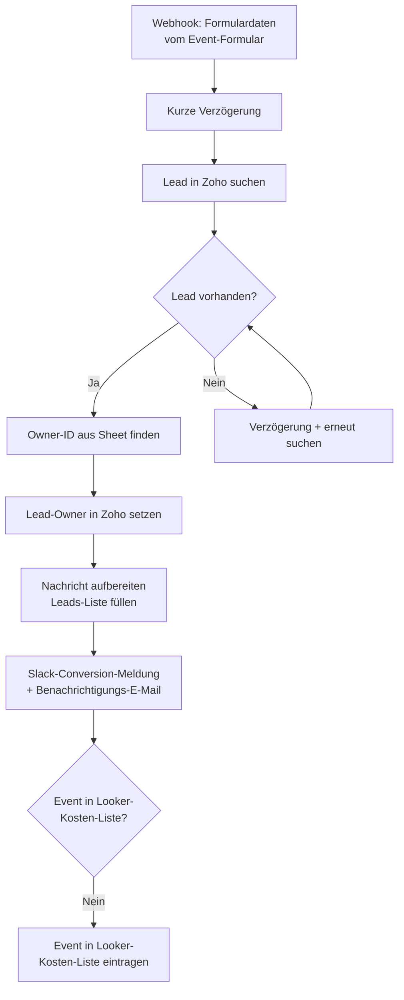

<Callout kind="info">
  **Bereich:** Events · **Status:** 🟢 Aktiv · **Make-ID:** 5178434
</Callout>

## Zweck

Wenn über das **Event-Formular** ein Datensatz in Zoho landet, ordnet dieser Flow den Lead dem **richtigen Owner** zu, dokumentiert die Conversion (Notiz im Spreadsheet, **Slack-Meldung** im Conversion-Chat, Benachrichtigungs-E-Mail) und ergänzt das Event bei Bedarf in der **Looker-Kosten-Liste**. Da der zugehörige Lead nach dem Formular-Eingang nicht sofort in Zoho verfügbar ist, sucht der Flow ihn in mehreren Anläufen.

## Auf einen Blick

| | |
| --- | --- |
| **Auslöser** | Webhook — Formulardaten vom Event-Formular (aus Zoho) |
| **Häufigkeit** | Sofort bei jeder Übermittlung (Echtzeit) |
| **Verknüpfte Tools** | Zoho CRM, Google Sheets, Slack, E-Mail |
| **Schreibt nach** | Zoho CRM (Lead-Owner), Google Sheets (Leads-Liste + Looker-Kosten-Liste), Slack, E-Mail |
| **Wo zu finden** | [Make-Szenario öffnen ↗](https://eu2.make.com/548585/scenarios/5178434/edit) |

## Ablauf

Der Lead ist nach dem Formular-Eingang nicht immer sofort in Zoho angelegt. Deshalb sucht der Flow ihn mit kurzer Verzögerung und versucht es bei Misserfolg **erneut** (mehrstufiger Retry über verschachtelte Router).

<Steps>
  <Step title="Formulardaten empfangen">
    Die Event-Formular-Daten kommen per Webhook an. Eine kurze **Verzögerung** stellt sicher, dass Zoho den zugehörigen Lead bereits verarbeiten konnte.
  </Step>
  <Step title="Lead suchen (mit Retry)">
    Der Flow sucht den Lead in Zoho. Wird er noch **nicht gefunden**, wartet er erneut und sucht ein weiteres Mal — über mehrere Stufen, bis der Lead vorliegt.
  </Step>
  <Step title="Owner zuordnen">
    Aus einer **Owner-Liste in Google Sheets** wird die passende Owner-ID ermittelt und als **Lead-Owner** in Zoho gesetzt.
  </Step>
  <Step title="Conversion dokumentieren">
    Die Nachricht wird aufbereitet (Anführungszeichen entfernt), der Lead in die **Leads-Liste** im Spreadsheet geschrieben, eine **Conversion-Meldung in Slack** gepostet und eine **Benachrichtigungs-E-Mail** versendet.
  </Step>
  <Step title="Looker-Kosten-Liste pflegen">
    Der Flow prüft, ob das Event bereits in der **Looker-Kosten-Liste** steht. Falls nicht, wird es ergänzt.
  </Step>
</Steps>

## Daten

| Rein | Raus |
| --- | --- |
| Formulardaten vom Event-Formular (Name, Nachricht, Event u. a.) | Zoho-Lead mit gesetztem Owner, Eintrag in Leads-Liste (Sheet), Eintrag in Looker-Kosten-Liste (Sheet), Slack-Conversion-Meldung, Benachrichtigungs-E-Mail |

## Wichtige Regeln

<Callout kind="info">
  **Mehrstufiger Retry:** Da der Lead nach dem Formular-Eingang nicht sofort in Zoho verfügbar ist, sucht der Flow ihn über mehrere Stufen mit zwischengeschalteter Verzögerung. Erst wenn der Lead gefunden wurde, werden Owner, Notiz und Slack-Meldung verarbeitet.
</Callout>

<Callout kind="info">
  **Looker-Kosten-Liste nur einmal pro Event:** Das Event wird nur dann ergänzt, wenn es noch nicht in der Liste steht — Dubletten werden so vermieden.
</Callout>

## Fehlerfälle

| Symptom | Mögliche Ursache | Erste Maßnahme |
| --- | --- | --- |
| Lead-Owner bleibt leer | Owner-ID nicht in der Sheet-Owner-Liste gefunden | Owner-Liste in Google Sheets prüfen, ob der zuständige Owner hinterlegt ist |
| Lead wird gar nicht gefunden | Lead in Zoho (noch) nicht angelegt oder Retry-Stufen erschöpft | Letzte Ausführung in Make prüfen; kontrollieren, ob der vorgelagerte Flow den Lead angelegt hat |
| Keine Slack-Meldung | Slack-Verbindung getrennt | Slack-Connection in Make neu verbinden |
| Event fehlt in Looker-Kosten-Liste | Event galt als bereits vorhanden oder Sheet-Verbindung defekt | Looker-Kosten-Liste und Google-Sheets-Verbindung kontrollieren |
