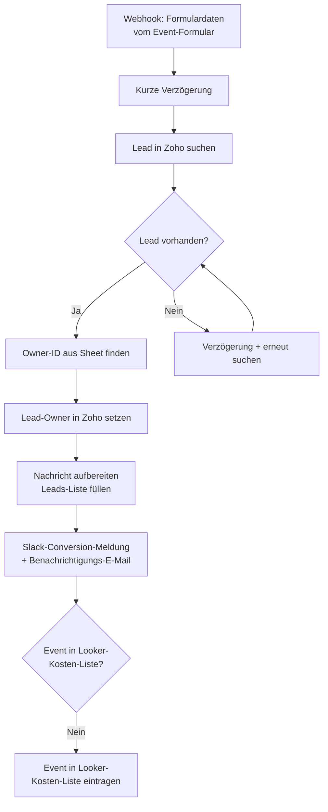

<Callout kind="info">
  **Bereich:** Events · **Status:** Aktiv · **Make-ID:** 5178434
</Callout>

## Verwendete Tools

`Zoho CRM` `Google Sheets` `Slack` `E-Mail`

## In a nutshell

Landet über das **Event-Formular** ein Datensatz in Zoho, ordnet dieser Flow den Lead dem **richtigen Owner** zu, hält die Conversion fest (eine Notiz im Spreadsheet, eine **Slack**-Meldung im Conversion-Chat, eine E-Mail an das Team) und ergänzt das Event bei Bedarf in der **Kostenliste für Looker**. Direkt nach dem Eingang ist der Lead oft noch nicht in Zoho, deshalb sucht ihn der Flow in mehreren Anläufen.

## Ablauf

Der Lead ist nach dem Formular-Eingang nicht immer sofort in Zoho angelegt. Deshalb sucht der Flow ihn mit kurzer Verzögerung und versucht es bei Misserfolg **erneut** (mehrstufiger Retry über verschachtelte Router).

## Auf einen Blick

- **Auslöser:** Webhook mit den Formulardaten aus Zoho
- **Häufigkeit:** Sofort bei jeder Übermittlung (Echtzeit)
- **Schreibt nach:** Zoho CRM (Lead-Owner), Google Sheets (Leads-Liste und Kostenliste für Looker), Slack, E-Mail
- **Wo zu finden:** [Make-Szenario öffnen ↗](https://eu2.make.com/548585/scenarios/5178434/edit)

## Im Detail

<Steps>
  <Step title="Formulardaten empfangen">
    Die Event-Formular-Daten kommen per Webhook an. Eine kurze **Verzögerung** stellt sicher, dass Zoho den zugehörigen Lead bereits verarbeiten konnte.
  </Step>
  <Step title="Lead suchen (mit Retry)">
    Der Flow sucht den Lead in Zoho. Wird er noch **nicht gefunden**, wartet er erneut und sucht ein weiteres Mal, und das über mehrere Stufen, bis der Lead vorliegt.
  </Step>
  <Step title="Owner zuordnen">
    Aus einer **Owner-Liste in Google Sheets** wird die passende Owner-ID ermittelt und als **Lead-Owner** in Zoho gesetzt.
  </Step>
  <Step title="Conversion dokumentieren">
    Die Nachricht wird aufbereitet (Anführungszeichen entfernt), der Lead in die **Leads-Liste** im Spreadsheet geschrieben, eine **Conversion-Meldung in Slack** gepostet und eine **E-Mail an das Team** versendet.
  </Step>
  <Step title="Kostenliste für Looker pflegen">
    Der Flow prüft, ob das Event bereits in der **Kostenliste für Looker** steht. Falls nicht, wird es ergänzt.
  </Step>
</Steps>

### Daten

| Rein | Raus |
| --- | --- |
| Formulardaten vom Event-Formular (Name, Nachricht, Event u. a.) | Zoho-Lead mit gesetztem Owner, Eintrag in Leads-Liste (Sheet), Eintrag in Kostenliste für Looker (Sheet), Slack-Conversion-Meldung, E-Mail an das Team |

### Wichtige Regeln

<Callout kind="info">
  **Mehrstufiger Retry:** Da der Lead nach dem Eingang des Formulars nicht sofort in Zoho verfügbar ist, sucht der Flow ihn über mehrere Stufen mit zwischengeschalteter Verzögerung. Erst wenn der Lead gefunden wurde, werden Owner, Notiz und Slack-Meldung verarbeitet.
</Callout>

<Callout kind="info">
  **Kostenliste für Looker nur einmal pro Event:** Das Event wird nur dann ergänzt, wenn es noch nicht in der Liste steht. So werden Dubletten vermieden.
</Callout>

### Fehlerfälle

| Symptom | Mögliche Ursache | Erste Maßnahme |
| --- | --- | --- |
| Lead-Owner bleibt leer | Owner-ID nicht in der Sheet-Owner-Liste gefunden | Owner-Liste in Google Sheets prüfen, ob der zuständige Owner hinterlegt ist |
| Lead wird gar nicht gefunden | Lead in Zoho (noch) nicht angelegt oder Retry-Stufen erschöpft | Letzte Ausführung in Make prüfen; kontrollieren, ob der vorgelagerte Flow den Lead angelegt hat |
| Keine Slack-Meldung | Slack-Verbindung getrennt | Slack-Connection in Make neu verbinden |
| Event fehlt in Kostenliste für Looker | Event galt als bereits vorhanden oder Sheet-Verbindung defekt | Kostenliste für Looker und Google-Sheets-Verbindung kontrollieren |
