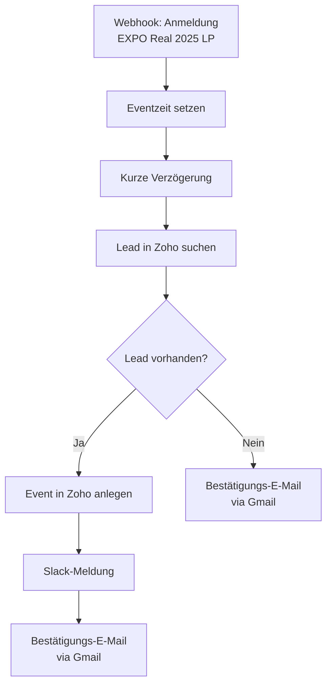

<Callout kind="info">
  **Bereich:** Events · **Status:** Aktiv · **Make-ID:** 6501797
</Callout>

## Verwendete Tools

`Zoho CRM` `Slack` `Gmail`

## In a nutshell

Jede Anmeldung über das Formular der **EXPO Real 2025 Landingpage** wird automatisch verarbeitet: Der Flow legt in Zoho ein **Event** an, postet eine **Slack-Meldung** und versendet eine **Bestätigungs-E-Mail** an den Interessenten. Zur korrekten Zuordnung wird zuvor der passende Lead in Zoho gesucht.

## Ablauf

## Auf einen Blick

- **Auslöser:** Webhook — Formular der EXPO Real 2025 Landingpage
- **Häufigkeit:** Sofort bei jeder Anmeldung (Echtzeit)
- **Schreibt nach:** Zoho CRM (Event), Slack, Gmail (Bestätigungs-E-Mail)
- **Wo zu finden:** [Make-Szenario öffnen ↗](https://eu2.make.com/548585/scenarios/6501797/edit)

## Im Detail

<Steps>
  <Step title="Anmeldung empfangen">
    Die Formulardaten der Landingpage kommen per Webhook an. Die **Eventzeit** wird gesetzt und eine kurze **Verzögerung** zwischengeschaltet.
  </Step>
  <Step title="Lead suchen">
    Der Flow sucht in Zoho nach dem passenden **Lead**, um das Event korrekt zuordnen zu können.
  </Step>
  <Step title="Event anlegen & benachrichtigen">
    Ist ein Lead vorhanden, wird in Zoho ein **Event** angelegt, eine **Slack-Meldung** gepostet und eine **Bestätigungs-E-Mail** versendet.
  </Step>
  <Step title="Lead nicht vorhanden">
    Wird kein Lead gefunden, versendet der Flow dennoch eine **Bestätigungs-E-Mail** an den Interessenten.
  </Step>
</Steps>

### Daten

| Rein | Raus |
| --- | --- |
| Anmeldedaten vom EXPO-Real-2025-Landingpage-Formular, Eventzeit | Zoho-Event, Slack-Meldung, Bestätigungs-E-Mail (Gmail) |

### Fehlerfälle

| Symptom | Mögliche Ursache | Erste Maßnahme |
| --- | --- | --- |
| Kein Event in Zoho | Webhook nicht ausgelöst, kein Lead gefunden oder Zoho-Verbindung abgelaufen | Letzte Ausführung in Make prüfen, Zoho-Connection neu autorisieren |
| Keine Bestätigungs-E-Mail | Gmail-Verbindung getrennt | Gmail-Connection in Make neu verbinden |
| Keine Slack-Meldung | Slack-Verbindung getrennt | Slack-Connection in Make neu verbinden |
| Event nicht zugeordnet | Passender Lead in Zoho nicht gefunden | Prüfen, ob der Lead in Zoho existiert; ggf. Suchkriterien kontrollieren |
