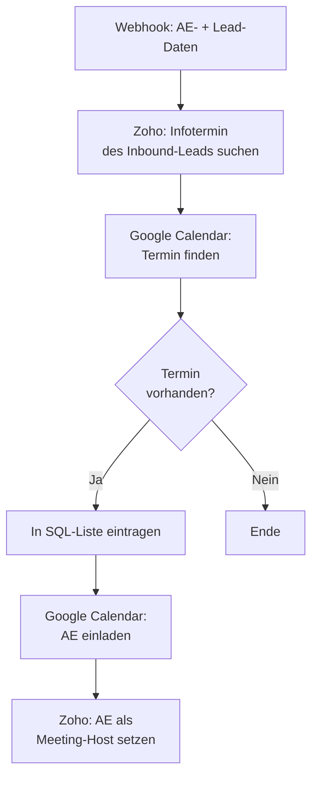

<Callout kind="info">
  **Bereich:** Termine und Calendly · **Status:** Aktiv · **Make-ID:** 4680166
</Callout>

## Verwendete Tools

`Zoho CRM` `Google Calendar` `Google Sheets`

## In a nutshell

Bucht ein **Inbound-Lead** einen Infotermin, hängt dieser Flow den zuständigen **Account Executive** richtig an den Termin: Er setzt ihn in **Zoho** als **Host des Meetings** und lädt ihn im **Google Calendar** ein. Den Termin trägt er außerdem in die **SQL-Liste** (Google Sheet) ein.

## Ablauf

## Auf einen Blick

- **Auslöser:** Webhook mit den Daten zum AE und zum Zoho Inbound Lead
- **Häufigkeit:** Sofort bei eingehendem Inbound-Termin (Echtzeit)
- **Schreibt nach:** Zoho CRM (Host des Meetings), Google Calendar (Einladung), Google Sheets (SQL-Liste)
- **Wo zu finden:** [Make-Szenario öffnen ↗](https://eu2.make.com/548585/scenarios/4680166/edit)

## Im Detail

<Steps>
  <Step title="Daten empfangen">
    Ein Webhook liefert die **Daten zum AE und zum Zoho Inbound Lead**.
  </Step>
  <Step title="Termin in Zoho suchen">
    Der Flow sucht in Zoho CRM den **Infotermin des Inbound-Leads**.
  </Step>
  <Step title="Termin im Kalender finden">
    Anschließend wird der zugehörige **Termin im Google Calendar** gesucht.
  </Step>
  <Step title="In SQL-Liste eintragen">
    Ist der Kalendertermin vorhanden, wird er in die **SQL-Liste** (Google Sheet) eingetragen.
  </Step>
  <Step title="AE einladen und als Host setzen">
    Der **AE wird im Google Calendar zum Termin eingeladen** und in Zoho CRM als **Host des Infotermins** festgelegt.
  </Step>
</Steps>

### Daten

| Rein | Raus |
| --- | --- |
| Daten zum AE und zum Zoho Inbound Lead (per Webhook) | Zoho-Meeting mit AE als Host, Einladung an den AE im Google Calendar, Zeile in der SQL-Liste |

### Wichtige Regeln

<Callout kind="info">
  **Nur bei vorhandenem Kalendertermin:** Die Zeile in der SQL-Liste wird nur geschrieben, wenn im Google Calendar ein passender Termin gefunden wurde.
</Callout>

### Fehlerfälle

| Symptom | Mögliche Ursache | Erste Maßnahme |
| --- | --- | --- |
| AE nicht als Host gesetzt | Infotermin in Zoho nicht gefunden | Webhook-Daten und Zoho-Suche prüfen |
| Keine Kalender-Einladung | Termin im Google Calendar nicht gefunden | Calendar-Suche und Zeitfenster kontrollieren |
| Kein Eintrag in SQL-Liste | Kalendertermin fehlte (Filter greift) | Prüfen, ob der Google-Calendar-Termin existiert |
| Verbindung zu Zoho oder Calendar abgelaufen | Connection getrennt | Verbindungen in Make neu autorisieren |
