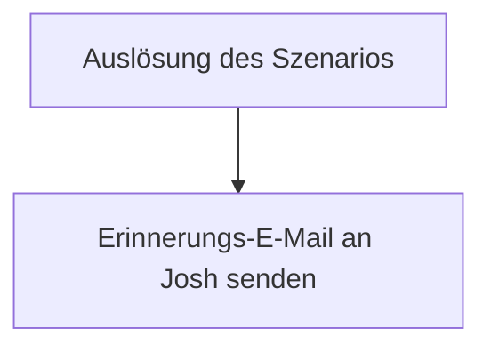

<Callout kind="info">
  **Bereich:** Cold-E-Mail & Sonstiges · **Status:** Aktiv · **Make-ID:** 4867273
</Callout>

## Verwendete Tools

`Gmail`

## In a nutshell

Ein Ein-Modul-Flow: Er **erinnert Josh per E-Mail**, die **Yoyaba- und AddSales-Kosten** einzutragen. So bleiben die Kosten im Reporting aktuell, ohne dass jemand dran denken muss.

## Ablauf

## Auf einen Blick

- **Auslöser:** Gmail-Versand-Modul (sendet die Erinnerungs-E-Mail)
- **Häufigkeit:** Wiederkehrend, vermutlich per Zeitplan — zu bestätigen
- **Schreibt nach:** E-Mail an Josh
- **Wo zu finden:** [Make-Szenario öffnen ↗](https://eu2.make.com/548585/scenarios/4867273/edit)

## Im Detail

<Steps>
  <Step title="Erinnerung versenden">
    Das **Gmail-Modul** verschickt eine Erinnerungs-E-Mail an Josh mit dem Hinweis, die **Yoyaba- und AddSales-Kosten** einzutragen.
  </Step>
</Steps>

### Daten

| Rein | Raus |
| --- | --- |
| Keine externen Eingangsdaten (Szenario löst sich selbst aus) | Erinnerungs-E-Mail an Josh |

### Fehlerfälle

| Symptom | Mögliche Ursache | Erste Maßnahme |
| --- | --- | --- |
| Keine Erinnerungs-E-Mail | Szenario deaktiviert oder Zeitplan nicht gesetzt | Im Make-Szenario prüfen, ob es aktiv ist und ein Zeitplan hinterlegt ist |
| E-Mail wird nicht zugestellt | Gmail-Verbindung abgelaufen | Gmail-Connection in Make neu autorisieren |
