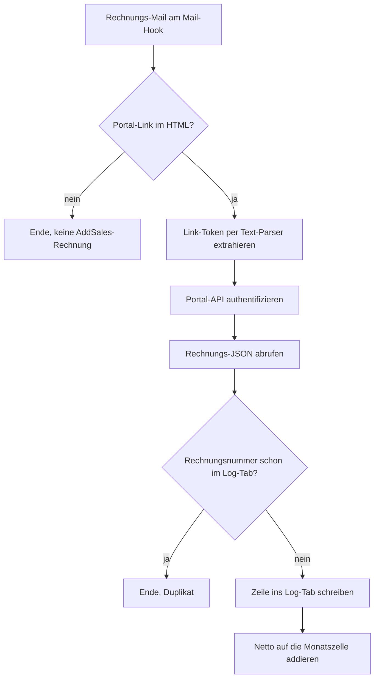

<Callout kind="info">
  **Bereich:** Reporting und Dashboard · **Status:** Aktiv (live seit 30.07.2026) · **Make-ID:** 8895203
</Callout>

## Verwendete Tools

`E-Mail` `HTTP` `Text-Parser` `Google Sheets`

## In a nutshell

AddSales stellt Rechnungen über das Lexware-Kundenportal, die Mail enthält nur einen Portal-Link statt eines echten PDF-Anhangs. Dieser Flow authentifiziert sich gegen die Portal-API, liest die strukturierten Rechnungsdaten aus und addiert den Netto-Betrag auf die passende Monatszelle im Kosten-Sheet. Damit landet jede Rechnung ohne manuelles Eintragen im Dashboard-Reporting.

## Ablauf

## Auf einen Blick

- **Auslöser:** Mail-Hook, jede eingehende Rechnungs-Mail (auch manuell weitergeleitete alte Rechnungen funktionieren, der Filter prüft nur den Portal-Link, nicht den Absender)
- **Häufigkeit:** Sofort bei jeder Mail
- **Schreibt nach:** KPI-Kosten-Sheet (Log-Tab plus Monatszelle)
- **Wo zu finden:** [Make-Szenario öffnen ↗](https://eu2.make.com/548585/scenarios/8895203/edit)

## Im Detail

<Steps>
  <Step title="Mail empfangen und filtern">
    Der Mail-Hook nimmt die Rechnungs-Mail an. Weiter geht es nur, wenn das HTML den Lexware-Portal-Link enthält.
  </Step>
  <Step title="Rechnungsdaten über die Portal-API holen">
    Lexware liefert kein echtes PDF im Anhang, sondern einen Portal-Link. Der Flow authentifiziert sich gegen die Portal-API (das Portal verlangt als Geheimnis die Postleitzahl des Empfängers) und erhält ein strukturiertes Rechnungs-JSON: Rechnungsnummer, Datum, Positionen mit Netto-Preisen und Steuersätzen, Bruttobetrag.
  </Step>
  <Step title="Duplikat-Check">
    Vor dem Verbuchen prüft der Flow die Rechnungsnummer gegen den Log-Tab. Bereits verbuchte Rechnungen enden hier, auch bei doppelter Mail-Zustellung.
  </Step>
  <Step title="Verbuchen">
    Eine Zeile wandert in den Log-Tab, danach wird der Netto-Betrag auf die Monatszelle des Rechnungsmonats addiert. Der Flow läuft sequentiell, damit zwei gleichzeitig eintreffende Rechnungen sich beim Addieren nicht überschreiben.
  </Step>
</Steps>

### Wichtige Regeln

<Callout kind="info">
  **Netto-Berechnung:** Netto ergibt sich aus Brutto geteilt durch (1 plus Steuersatz der ersten Position). **Spalten-Zuordnung:** Enthält eine Position das Wort "cold", zählt der Betrag zur Coldmail-Spalte, alles andere (auch SDR Inbound und Event-Akquise) zur Calling-Spalte. Das ist ein bewusster Default.
</Callout>

### Daten

| Rein | Raus |
| --- | --- |
| Rechnungs-Mail mit Portal-Link | Log-Zeile (Rechnungsnummer, Datum, Netto) und aktualisierte Monatszelle im Kosten-Sheet |

### Fehlerfälle

| Symptom | Mögliche Ursache | Erste Maßnahme |
| --- | --- | --- |
| Flow wird nicht ausgelöst | Mail ging nicht an die Hook-Adresse | Rechnungs-Mail einfach an die Hook-Adresse weiterleiten, der Absender ist egal |
| Rechnung fehlt im Sheet | Portal-Link abgelaufen oder API-Antwort leer | Letzte Ausführung im Make-Szenario prüfen, Mail erneut weiterleiten |
| Betrag doppelt | Duplikat-Check greift nur über die Rechnungsnummer | Log-Tab auf die Rechnungsnummer prüfen und die Monatszelle manuell korrigieren |
