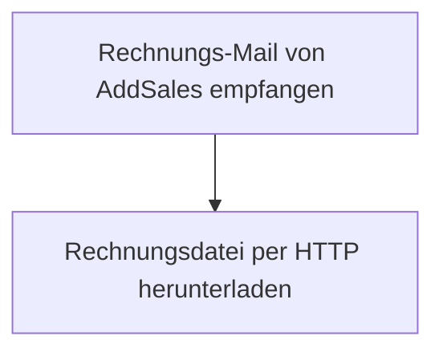

<Callout kind="info">
  **Bereich:** Reporting / Dashboard · **Status:** Aktiv · **Make-ID:** 8895203
</Callout>

## Verwendete Tools

`E-Mail (Mail-Hook)` `HTTP`

## In a nutshell

AddSales schickt **Rechnungen per E-Mail**. Dieser Flow fängt diese Mails über einen Mail-Hook ab und **lädt die enthaltene Rechnungsdatei automatisch herunter** — als Grundlage für die weitere Kostenerfassung im Reporting.

## Ablauf

## Auf einen Blick

- **Auslöser:** Mail-Hook — eingehende Rechnungs-E-Mail von AddSales
- **Häufigkeit:** Sofort bei jeder eingehenden Rechnungs-Mail (Echtzeit)
- **Schreibt nach:** Datei-Download (Rechnungsdatei)
- **Wo zu finden:** [Make-Szenario öffnen ↗](https://eu2.make.com/548585/scenarios/8895203/edit)

## Im Detail

<Steps>
  <Step title="Rechnungs-Mail empfangen">
    Der **Mail-Hook „Rechnungen AddSales"** empfängt die eingehende E-Mail von AddSales.
  </Step>
  <Step title="Datei herunterladen">
    Über einen **HTTP-Download** wird die in der Mail referenzierte Rechnungsdatei abgerufen.
  </Step>
</Steps>

### Daten

| Rein | Raus |
| --- | --- |
| Eingehende AddSales-Rechnungs-Mail (Datei-Link) | Heruntergeladene Rechnungsdatei |

### Fehlerfälle

| Symptom | Mögliche Ursache | Erste Maßnahme |
| --- | --- | --- |
| Flow wird nicht ausgelöst | Mail-Hook empfängt keine Mail (Weiterleitung/Adresse falsch) | Mail-Hook-Adresse prüfen und Test-Mail an den Hook senden |
| Datei wird nicht heruntergeladen | Download-Link in der Mail ungültig oder abgelaufen | Im Make-Szenario die letzte Ausführung prüfen, Mail-Inhalt und HTTP-Request kontrollieren |
