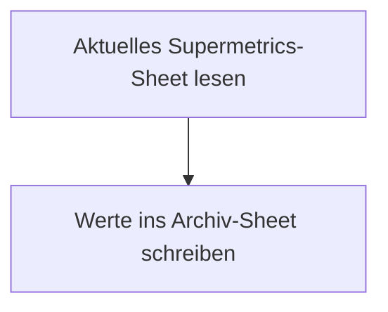

<Callout kind="info">
  **Bereich:** Reporting und Dashboard · **Status:** Aktiv · **Make-ID:** 4455501
</Callout>

## Verwendete Tools

`Google Sheets`

## In a nutshell

Das Sheet von Supermetrics zeigt immer nur die **aktuellen Werbeausgaben** und wird laufend überschrieben. Dieser kleine Flow liest die Werte aus und hängt sie an ein **Archiv-Sheet** an. So bleibt der tägliche Verlauf der Werbeausgaben erhalten, als Datenbasis für Reporting und Dashboards.

## Ablauf

## Auf einen Blick

- **Auslöser:** Google Sheets, der Inhalt des aktuellen Ad-Spend-Sheets wird gelesen
- **Häufigkeit:** Täglich
- **Schreibt nach:** Google Sheets (Archiv-Sheet)
- **Wo zu finden:** [Make-Szenario öffnen ↗](https://eu2.make.com/548585/scenarios/4455501/edit)

## Im Detail

<Steps>
  <Step title="Aktuelles Sheet lesen">
    Der Flow liest den Inhalt des aktuellen Ad-Spend-Sheets von Supermetrics aus.
  </Step>
  <Step title="Ins Archiv schreiben">
    Die ausgelesenen Werte werden als **neue Zeile** in das Archiv-Sheet geschrieben.
  </Step>
</Steps>

### Daten

| Rein | Raus |
| --- | --- |
| Aktuelle Werbeausgaben aus dem Sheet von Supermetrics | Neue Zeile im Archiv-Sheet |

### Fehlerfälle

| Symptom | Mögliche Ursache | Erste Maßnahme |
| --- | --- | --- |
| Keine neue Zeile im Archiv | Flow nicht ausgeführt oder Google-Sheets-Verbindung abgelaufen | Im Make-Szenario die letzte Ausführung prüfen, Google-Connection neu autorisieren |
| Leere oder falsche Werte im Archiv | Quell-Sheet von Supermetrics nicht aktualisiert oder verschoben | Prüfen, ob das Sheet von Supermetrics befüllt ist und der Sheet-Bezug im Lese-Modul stimmt |
