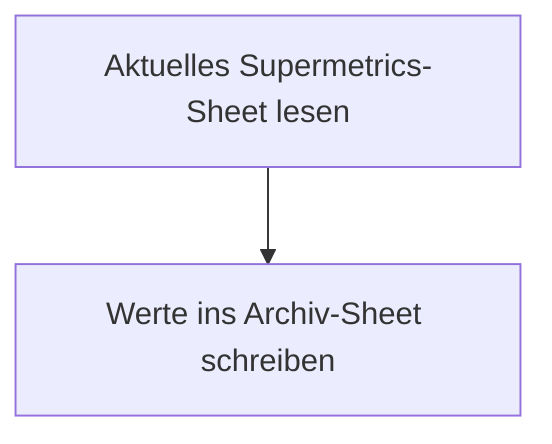

<Callout kind="info">
  **Bereich:** Reporting / Dashboard · **Status:** 🟢 Aktiv · **Make-ID:** 4455501
</Callout>

## Zweck

Das Supermetrics-Sheet enthält immer nur die **aktuellen Ad-Spend-Werte** und wird laufend überschrieben. Dieser kleine Flow liest diese Werte aus und hängt sie an ein **Archiv-Sheet** an. So entsteht ein dauerhafter Verlauf der täglichen Werbeausgaben als Datenbasis für Reporting und Dashboards.

## Auf einen Blick

| | |
| --- | --- |
| **Auslöser** | Google Sheets — Inhalt des aktuellen Ad-Spend-Sheets wird gelesen |
| **Häufigkeit** | Täglich |
| **Verknüpfte Tools** | Google Sheets |
| **Schreibt nach** | Google Sheets (Archiv-Sheet) |
| **Wo zu finden** | [Make-Szenario öffnen ↗](https://eu2.make.com/548585/scenarios/4455501/edit) |

## Ablauf

<Steps>
  <Step title="Aktuelles Sheet lesen">
    Der Flow liest den **Inhalt des aktuellen Supermetrics-Ad-Spend-Sheets** aus.
  </Step>
  <Step title="Ins Archiv schreiben">
    Die ausgelesenen Werte werden als **neue Zeile** in das Archiv-Sheet geschrieben.
  </Step>
</Steps>

## Daten

| Rein | Raus |
| --- | --- |
| Aktuelle Ad-Spend-Werte aus dem Supermetrics-Sheet | Neue Zeile im Archiv-Sheet |

## Fehlerfälle

| Symptom | Mögliche Ursache | Erste Maßnahme |
| --- | --- | --- |
| Keine neue Zeile im Archiv | Flow nicht ausgeführt oder Google-Sheets-Verbindung abgelaufen | Im Make-Szenario die letzte Ausführung prüfen, Google-Connection neu autorisieren |
| Leere oder falsche Werte im Archiv | Quell-Sheet von Supermetrics nicht aktualisiert oder verschoben | Prüfen, ob das Supermetrics-Sheet befüllt ist und der Sheet-Bezug im Lese-Modul stimmt |
