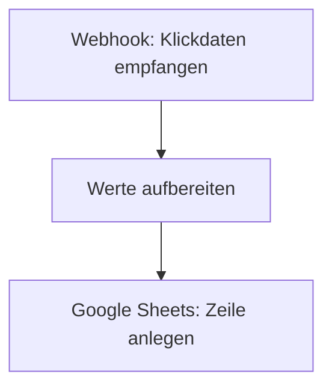

<Callout kind="info">
  **Bereich:** Reporting / Dashboard · **Status:** Aktiv · **Make-ID:** 2082018
</Callout>

## Verwendete Tools

`Google Sheets`

## In a nutshell

Nimmt **tägliche Klickdaten per Webhook** entgegen und schreibt sie als neue Zeile ins **Reporting-Sheet**. Damit hat das Dashboard jeden Tag frische Klickwerte.

## Ablauf

## Auf einen Blick

- **Auslöser:** Webhook — eingehende Klickdaten
- **Häufigkeit:** Täglich (bei jedem Webhook-Aufruf)
- **Schreibt nach:** Google Sheets (Reporting-Sheet)
- **Wo zu finden:** [Make-Szenario öffnen ↗](https://eu2.make.com/548585/scenarios/2082018/edit)

## Im Detail

<Steps>
  <Step title="Klickdaten empfangen">
    Der Webhook nimmt die **täglichen Klickdaten** entgegen.
  </Step>
  <Step title="Aufbereiten">
    Die Werte werden in einer Variablen **aufbereitet**.
  </Step>
  <Step title="Ins Sheet schreiben">
    Die Klickdaten werden als **neue Zeile ins Google Sheet** geschrieben.
  </Step>
</Steps>

### Daten

| Rein | Raus |
| --- | --- |
| Klickdaten aus dem Webhook | Neue Zeile im Google-Sheet (Reporting) |

### Fehlerfälle

| Symptom | Mögliche Ursache | Erste Maßnahme |
| --- | --- | --- |
| Keine neue Zeile im Sheet | Webhook nicht ausgelöst | Im Make-Szenario die letzte Ausführung prüfen, Quelle des Webhook-Aufrufs kontrollieren |
| Zeile mit leeren Werten | Aufbereitungs-Schritt erhält kein erwartetes Feld | Variablen-Schritt und Webhook-Payload prüfen |
| Schreiben ins Sheet schlägt fehl | Google-Sheets-Verbindung getrennt oder Sheet/Tab umbenannt | Google-Sheets-Connection und Zielsheet in Make prüfen |
