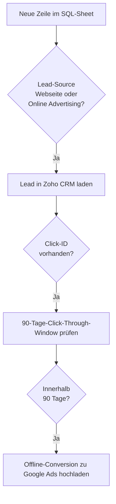

<Callout kind="info">
  **Bereich:** Reporting / Dashboard · **Status:** Aktiv · **Make-ID:** 6025678
</Callout>

## Verwendete Tools

`Google Sheets` `Zoho CRM` `Google Ads Conversions`

## In a nutshell

Sales-Qualified-Leads (SQL) aus der Webseite und aus bezahlter Werbung sollen als **Offline-Conversion** an Google Ads zurückgemeldet werden, damit die Kampagnen-Optimierung auf echten Geschäftserfolg statt nur auf Klicks lernt. Der Flow überwacht das SQL-Sheet und lädt für jeden passenden Lead eine Conversion hoch — aber nur, wenn **Lead-Source, Click-ID und Click-Through-Fenster** stimmen.

## Ablauf

## Auf einen Blick

- **Auslöser:** Google Sheets — neue Zeile im SQL-Sheet
- **Häufigkeit:** Laufend bei jedem neuen SQL-Eintrag
- **Schreibt nach:** Google Ads (Offline-Conversion)
- **Wo zu finden:** [Make-Szenario öffnen ↗](https://eu2.make.com/548585/scenarios/6025678/edit)

## Im Detail

<Steps>
  <Step title="Neuer SQL-Eintrag">
    Eine **neue Zeile im SQL-Sheet** löst den Flow aus.
  </Step>
  <Step title="Lead-Source prüfen">
    Der Lead wird nur weiterverarbeitet, wenn die **Lead-Source „Webseite" oder „Online Advertising"** ist.
  </Step>
  <Step title="Lead laden & Click-ID prüfen">
    Der zugehörige **Lead wird aus Zoho CRM geladen**. Weiter geht es nur, wenn eine **Click-ID** vorhanden ist.
  </Step>
  <Step title="90-Tage-Fenster prüfen">
    Es wird berechnet, ob der Klick **innerhalb des 90-Tage-Click-Through-Windows** liegt.
  </Step>
  <Step title="Conversion hochladen">
    Liegt der Klick im Fenster, wird die **Offline-Conversion zu Google Ads hochgeladen**.
  </Step>
</Steps>

### Daten

| Rein | Raus |
| --- | --- |
| SQL-Sheet-Zeile (Lead-Bezug), Zoho-Lead (Lead-Source, Click-ID, Datum) | Offline-Click-Conversion in Google Ads |

### Wichtige Regeln

<Callout kind="warning">
  **Drei Bedingungen müssen erfüllt sein**, sonst wird keine Conversion hochgeladen:
  - **Lead-Source** = „Webseite" oder „Online Advertising"
  - eine **Click-ID** ist am Lead hinterlegt
  - der Klick liegt **innerhalb von 90 Tagen** (Click-Through-Window)
</Callout>

### Fehlerfälle

| Symptom | Mögliche Ursache | Erste Maßnahme |
| --- | --- | --- |
| Conversion erscheint nicht in Google Ads | Eine der drei Bedingungen nicht erfüllt (Lead-Source, Click-ID, 90 Tage) | Lead in Zoho prüfen: Lead-Source, Click-ID und Klick-Datum kontrollieren |
| Flow läuft, lädt aber nie hoch | Click-ID fehlt durchgehend oder Klicks älter als 90 Tage | Tracking/Click-ID-Erfassung beim Lead-Eingang prüfen |
| Upload schlägt fehl | Google-Ads-Verbindung abgelaufen oder Conversion-Action falsch | Google-Ads-Connection neu autorisieren, letzte Ausführung im Szenario prüfen |
| Falscher Lead geladen | Lead-Bezug aus dem SQL-Sheet stimmt nicht | Zuordnung Sheet-Zeile → Zoho-Lead im Szenario prüfen |
