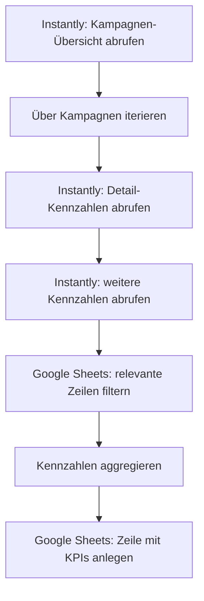

<Callout kind="info">
  **Bereich:** Reporting / Dashboard · **Status:** Aktiv · **Make-ID:** 2006361
</Callout>

## Verwendete Tools

`Instantly` `Google Sheets`

## In a nutshell

Sammelt die Leistungskennzahlen (KPIs) der **Cold-Mail-Kampagnen aus Instantly**, fasst sie zusammen und schreibt sie als neue Zeile ins **Dashboard-Sheet**. So bleibt das KPI-Reporting ohne manuelles Abtippen aus Instantly aktuell.

## Ablauf

## Auf einen Blick

- **Auslöser:** Instantly — Campaign Summary (Kampagnen-Kennzahlen)
- **Häufigkeit:** Je Ausführung des Szenarios
- **Schreibt nach:** Google Sheets (KPI-Dashboard-Sheet)
- **Wo zu finden:** [Make-Szenario öffnen ↗](https://eu2.make.com/548585/scenarios/2006361/edit)

## Im Detail

<Steps>
  <Step title="Kampagnen abrufen">
    Instantly liefert die **Übersicht der Cold-Mail-Kampagnen** mit ihren Kennzahlen.
  </Step>
  <Step title="Pro Kampagne durchlaufen">
    Der Flow iteriert über die Kampagnen und holt je Kampagne **weitere Kennzahlen** aus Instantly.
  </Step>
  <Step title="Sheet-Daten filtern">
    Im Google Sheet werden die **relevanten Zeilen gefiltert**, um sie für die Auswertung heranzuziehen.
  </Step>
  <Step title="Aggregieren">
    Die Kennzahlen werden **zusammengefasst** (aggregiert).
  </Step>
  <Step title="Ins Dashboard schreiben">
    Die aggregierten KPIs werden als **neue Zeile ins Google Sheet** geschrieben.
  </Step>
</Steps>

### Daten

| Rein | Raus |
| --- | --- |
| Kampagnen-Kennzahlen aus Instantly (Versand-, Reply- und Performance-Werte) | Aggregierte KPI-Zeile im Google-Sheet (KPI-Dashboard) |

### Fehlerfälle

| Symptom | Mögliche Ursache | Erste Maßnahme |
| --- | --- | --- |
| Keine neue KPI-Zeile im Sheet | Instantly-Verbindung abgelaufen oder keine Kampagnendaten zurückgeliefert | Im Make-Szenario die letzte Ausführung prüfen, Instantly-Connection neu autorisieren |
| Zahlen wirken unvollständig | Filter im Google-Sheets-Schritt greift zu eng | Filter-Schritt „filterRows" im Szenario kontrollieren |
| Werte werden nicht zusammengefasst | Aggregations-Schritt erhält keine Eingangsdaten | Iteration über die Kampagnen und die vorgelagerten Instantly-Schritte prüfen |
| Schreiben ins Sheet schlägt fehl | Google-Sheets-Verbindung getrennt oder Sheet/Tab umbenannt | Google-Sheets-Connection und Zielsheet in Make prüfen |
