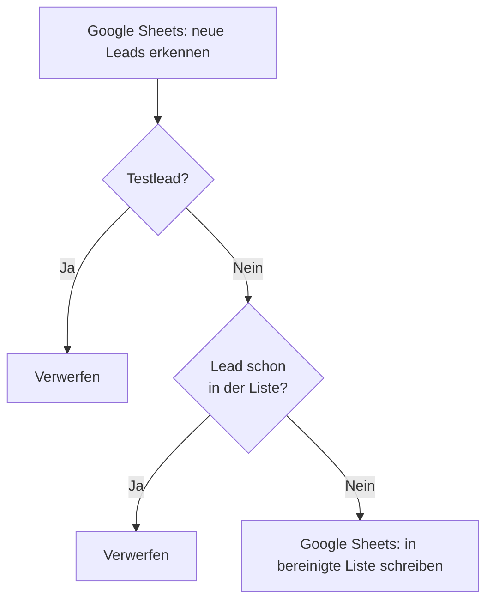

<Callout kind="info">
  **Bereich:** Reporting / Dashboard · **Status:** Aktiv · **Make-ID:** 4317229
</Callout>

## Verwendete Tools

`Google Sheets`

## In a nutshell

Überwacht **neue Leads im Looker-Studio-Sheet**, prüft sie gegen den **Bestand auf Dubletten** und filtert **Testleads** heraus. Nur echte, noch nicht vorhandene Leads landen in der bereinigten Liste, auf der das Looker-Studio-Reporting aufsetzt.

## Ablauf

## Auf einen Blick

- **Auslöser:** Google Sheets — neue Zeilen im Lead-Sheet (watchRows)
- **Häufigkeit:** Bei neuen Leads im überwachten Sheet
- **Schreibt nach:** Google Sheets (bereinigte Lead-Liste)
- **Wo zu finden:** [Make-Szenario öffnen ↗](https://eu2.make.com/548585/scenarios/4317229/edit)

## Im Detail

<Steps>
  <Step title="Neue Leads suchen">
    Der Flow überwacht das Lead-Sheet und erkennt **neue Zeilen**.
  </Step>
  <Step title="Dublette prüfen & Testlead filtern">
    Es wird geprüft, ob der neue Lead **bereits in der Liste** ist. Enthält der Lead das Wort „test", gilt er als **Testlead** und wird ausgeschlossen.
  </Step>
  <Step title="In bereinigte Liste schreiben">
    Nur **noch nicht vorhandene** Leads werden als neue Zeile in die **bereinigte Liste** übernommen.
  </Step>
</Steps>

### Daten

| Rein | Raus |
| --- | --- |
| Neue Lead-Zeilen aus dem überwachten Google-Sheet | Bereinigte, dublettenfreie Lead-Zeile (ohne Testleads) im Ziel-Sheet |

### Wichtige Regeln

<Callout kind="info">
  **Testleads werden gefiltert:** Enthält der Lead das Wort „test", wird er **nicht** in die bereinigte Liste übernommen. Zusätzlich werden Leads ausgeschlossen, die **bereits in der Liste** vorhanden sind.
</Callout>

### Fehlerfälle

| Symptom | Mögliche Ursache | Erste Maßnahme |
| --- | --- | --- |
| Keine neuen Leads in der bereinigten Liste | watchRows-Trigger findet keine neuen Zeilen oder Connection abgelaufen | Im Make-Szenario die letzte Ausführung prüfen, Google-Sheets-Connection neu autorisieren |
| Dubletten landen doch in der Liste | Dublettenprüfung greift nicht (z. B. abweichende Schreibweise) | Filter-Schritt „Überprüfen ob neue Leads bereits in der Liste sind" kontrollieren |
| Testleads landen in der Liste | Test-Filter hat nicht gegriffen | Prüfen, ob das Lead-Feld tatsächlich „test" enthält |
