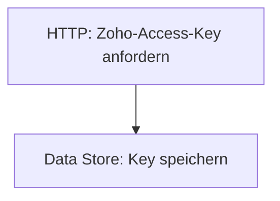

<Callout kind="info">
  **Bereich:** Reporting / Dashboard · **Status:** 🟢 Aktiv · **Make-ID:** 2129672
</Callout>

## Verwendete Tools

`HTTP` `Make Data Store`

## In a nutshell

Erneuert **stündlich den Zoho-API-Access-Key** und legt ihn im **Make Data Store** ab. Ein reiner Infrastruktur-Flow: Er hält ein gültiges Zugriffstoken bereit, damit andere Szenarien die Zoho-API ansprechen können, ohne sich jeweils neu zu authentifizieren.

## Ablauf

## Auf einen Blick

| | |
| --- | --- |
| **Auslöser** | HTTP — Token-Anfrage gegen die Zoho-API |
| **Häufigkeit** | Stündlich |
| **Schreibt nach** | Make Data Store (gecachter Zoho-Access-Key) |
| **Wo zu finden** | [Make-Szenario öffnen ↗](https://eu2.make.com/548585/scenarios/2129672/edit) |

## Im Detail

<Steps>
  <Step title="Key anfordern">
    Per HTTP-Request wird ein **frischer Zoho-API-Access-Key** abgerufen.
  </Step>
  <Step title="Key speichern">
    Der Access-Key wird als Datensatz im **Make Data Store** abgelegt und steht dort zentral zur Verfügung.
  </Step>
</Steps>

### Daten

| Rein | Raus |
| --- | --- |
| Token-Antwort der Zoho-API (Access-Key) | Gecachter Zoho-Access-Key im Make Data Store |

### Wird verwendet von

<Callout kind="info">
  Der gecachte Zoho-Token wird von **anderen Make-Szenarien wiederverwendet**, die die Zoho-API per HTTP ansprechen, ohne sich jeweils neu zu authentifizieren. So muss nicht jedes Szenario eine eigene Token-Anfrage stellen. _(zu ergänzen: konkrete konsumierende Szenarien)_
</Callout>

### Fehlerfälle

| Symptom | Mögliche Ursache | Erste Maßnahme |
| --- | --- | --- |
| Kein aktueller Key im Data Store | HTTP-Request gegen Zoho schlägt fehl (abgelaufene Credentials, geänderter Endpoint) | Im Make-Szenario die letzte Ausführung prüfen, Zoho-Credentials/HTTP-Konfiguration kontrollieren |
| Abhängige Szenarien können sich nicht an Zoho authentifizieren | Veralteter oder fehlender Key im Data Store | Diesen Flow manuell ausführen und prüfen, ob ein gültiger Key geschrieben wird |
| Stündliche Ausführung läuft nicht | Szenario deaktiviert oder Zeitplan gestoppt | Aktivierungs-Status und Scheduling im Make-Szenario prüfen |
