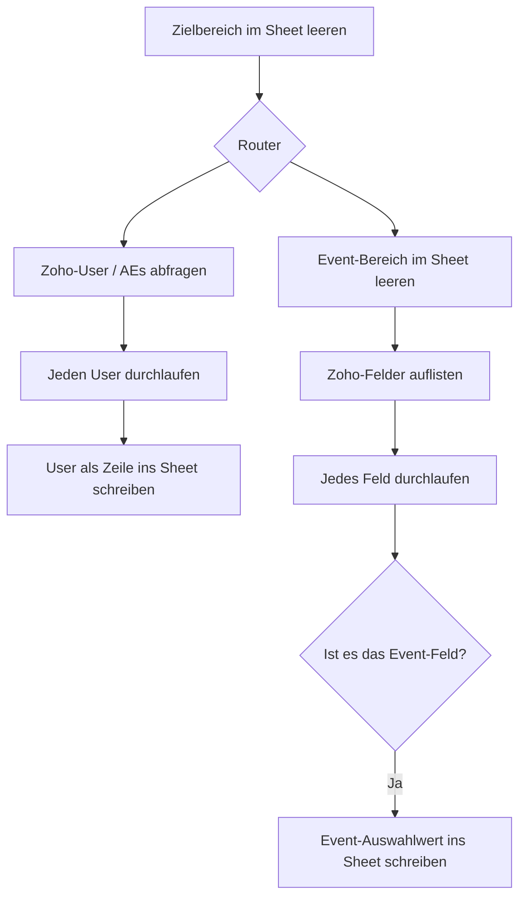

<Callout kind="info">
  **Bereich:** Reporting und Dashboard · **Status:** Aktiv · **Make-ID:** 3970929
</Callout>

## Verwendete Tools

`Zoho CRM` `Google Sheets`

## In a nutshell

Damit nachgelagerte Flows wie die Owner-Zuordnung von Leads mit aktuellen Stammdaten arbeiten, holt dieser Flow **wöchentlich die Liste der Nutzer in Zoho, also die Account Executives**, und die **Auswahlwerte des Event-Feldes** und schreibt beides in ein Google Sheet. Vorher leert er die alten Werte, damit das Sheet immer den aktuellen Stand zeigt.

## Ablauf

## Auf einen Blick

- **Auslöser:** Google Sheets, der Zielbereich wird zum Start des Laufs geleert
- **Häufigkeit:** Wöchentlich
- **Schreibt nach:** Google Sheets, die Nutzerliste und die Event-Werte
- **Wo zu finden:** [Make-Szenario öffnen ↗](https://eu2.make.com/548585/scenarios/3970929/edit)

## Im Detail

<Steps>
  <Step title="Sheet vorbereiten">
    Der Zielbereich im Google Sheet wird **geleert**, damit anschließend nur aktuelle Daten stehen.
  </Step>
  <Step title="Account Executives holen">
    Über einen Zweig werden die **Nutzer in Zoho, also die Account Executives**, abgefragt und einzeln als Zeilen ins Sheet geschrieben.
  </Step>
  <Step title="Event-Felder holen">
    Im zweiten Zweig werden die **Felder in Zoho aufgelistet**. Pro Feld wird geprüft, ob es das **Event-Feld** ist.
  </Step>
  <Step title="Event-Werte schreiben">
    Trifft die Prüfung **Event-Feld** zu, werden die zugehörigen Auswahlwerte ins Sheet geschrieben.
  </Step>
</Steps>

### Daten

| Rein | Raus |
| --- | --- |
| Liste der Account Executives aus Zoho, Feldliste aus Zoho samt Auswahlwerten des Event-Feldes | Google Sheet mit aktueller Nutzerliste und den Auswahlwerten des Event-Feldes |

### Wichtige Regeln

<Callout kind="info">
  **Nur das Event-Feld wird übernommen:** Beim Durchlaufen der Zoho-Felder schreibt der Flow ausschließlich das Feld mit der Bezeichnung **„Event"** ins Sheet, alle anderen Felder werden übersprungen.
</Callout>

### Fehlerfälle

| Symptom | Mögliche Ursache | Erste Maßnahme |
| --- | --- | --- |
| Sheet bleibt leer nach dem Lauf | Zoho-Verbindung abgelaufen oder Abfrage liefert keine Daten | Zoho-Connection neu autorisieren, letzte Ausführung im Make-Szenario prüfen |
| Nutzer fehlen oder sind veraltet | Wöchentlicher Lauf nicht ausgeführt | Im Make-Szenario die letzte Ausführung und den Zeitplan prüfen |
| Event-Werte fehlen | Event-Feld in Zoho umbenannt, der Filter „Ist Event Feld?" greift nicht mehr | Feldbezeichnung in Zoho prüfen und bei Bedarf den Filter im Szenario anpassen |
