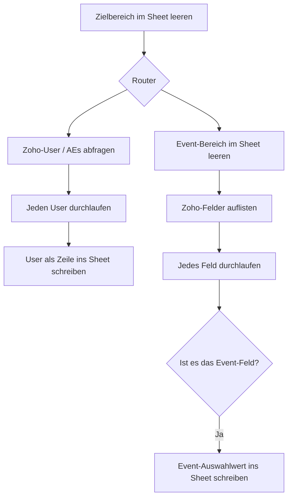

<Callout kind="info">
  **Bereich:** Reporting / Dashboard · **Status:** 🟢 Aktiv · **Make-ID:** 3970929
</Callout>

## Zweck

Damit nachgelagerte Flows (z. B. die Owner-Zuordnung von Leads) immer mit aktuellen Stammdaten arbeiten, holt dieser Flow **wöchentlich die Zoho-User-Liste (AEs)** sowie die **Auswahlwerte des Event-Feldes** aus Zoho CRM und schreibt beides in ein Google Sheet. Die alten Werte werden vorher geleert, damit das Sheet immer den aktuellen Stand abbildet.

## Auf einen Blick

| | |
| --- | --- |
| **Auslöser** | Google Sheets — Zielbereich wird geleert (Start des Laufs) |
| **Häufigkeit** | Wöchentlich |
| **Verknüpfte Tools** | Zoho CRM, Google Sheets |
| **Schreibt nach** | Google Sheets (User-Liste + Event-Werte) |
| **Wo zu finden** | [Make-Szenario öffnen ↗](https://eu2.make.com/548585/scenarios/3970929/edit) |

## Ablauf

<Steps>
  <Step title="Sheet vorbereiten">
    Der Zielbereich im Google Sheet wird **geleert**, damit anschließend nur aktuelle Daten stehen.
  </Step>
  <Step title="User / AEs holen">
    Über einen Zweig werden die **Zoho-User (AEs)** abgefragt und einzeln als Zeilen ins Sheet geschrieben.
  </Step>
  <Step title="Event-Felder holen">
    Im zweiten Zweig werden die **Zoho-Felder aufgelistet**. Pro Feld wird geprüft, ob es das **Event-Feld** ist.
  </Step>
  <Step title="Event-Werte schreiben">
    Trifft die Prüfung **Event-Feld** zu, werden die zugehörigen Auswahlwerte ins Sheet geschrieben.
  </Step>
</Steps>

## Daten

| Rein | Raus |
| --- | --- |
| Zoho-User-Liste (AEs), Zoho-Feldliste inkl. Event-Picklist | Google Sheet mit aktueller User-Liste und Event-Auswahlwerten |

## Wichtige Regeln

<Callout kind="info">
  **Nur das Event-Feld wird übernommen:** Beim Durchlaufen der Zoho-Felder schreibt der Flow ausschließlich das Feld mit der Bezeichnung **„Event"** ins Sheet — alle anderen Felder werden übersprungen.
</Callout>

## Fehlerfälle

| Symptom | Mögliche Ursache | Erste Maßnahme |
| --- | --- | --- |
| Sheet bleibt leer nach dem Lauf | Zoho-Verbindung abgelaufen oder Abfrage liefert keine Daten | Zoho-Connection neu autorisieren, letzte Ausführung im Make-Szenario prüfen |
| User fehlen / veraltet | Wöchentlicher Lauf nicht ausgeführt | Im Make-Szenario die letzte Ausführung und den Zeitplan prüfen |
| Event-Werte fehlen | Event-Feld in Zoho umbenannt — Filter „Ist Event Feld?" greift nicht mehr | Feldbezeichnung in Zoho prüfen und ggf. den Filter im Szenario anpassen |
