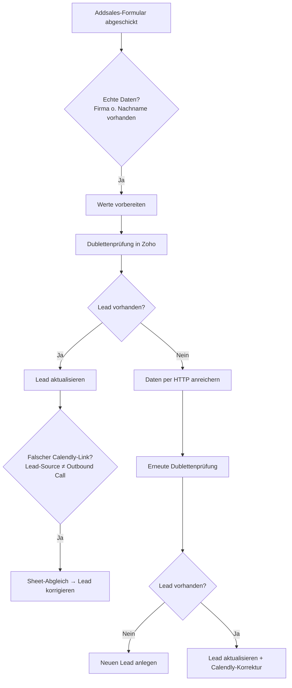

<Callout kind="info">
  **Bereich:** Lead-Intake / Webseite · **Status:** Aktiv · **Make-ID:** 3534404
</Callout>

## Verwendete Tools

`Zoho CRM` `Google Sheets` `HTTP`

## In a nutshell

Kommt eine Anfrage aus dem **Addsales-Formular**, bringt dieser Flow sie nach **Zoho CRM**: Er legt einen **neuen Lead an oder aktualisiert einen bestehenden**, reichert die Daten an und **korrigiert falsch genutzte Calendly-Links** über einen Abgleich in Google Sheets.

## Ablauf

## Auf einen Blick

- **Auslöser:** Webhook — Addsales-Formular
- **Häufigkeit:** Sofort bei jeder Anfrage (Echtzeit)
- **Schreibt nach:** Zoho CRM (Lead, mit Anreicherung)
- **Wo zu finden:** [Make-Szenario öffnen ↗](https://eu2.make.com/548585/scenarios/3534404/edit)

## Im Detail

<Steps>
  <Step title="Anfrage empfangen & Testdaten filtern">
    Der Webhook empfängt die Addsales-Formulardaten. Es geht nur weiter, wenn **Firma oder Nachname vorhanden** sind — leere Testaufrufe werden abgefangen.
  </Step>
  <Step title="Werte vorbereiten & Dublette prüfen">
    Die Felder werden in Variablen gesetzt und Zoho CRM wird durchsucht, ob der **Lead bereits existiert**.
  </Step>
  <Step title="Bestehender Lead — aktualisieren">
    Existiert der Lead, wird er **aktualisiert**. Anschließend prüft der Flow, ob ein **falscher Calendly-Link** genutzt wurde (Lead-Source ungleich „Outbound Call"). Ist das der Fall, wird über einen **Google-Sheets-Abgleich** die korrekte Zuordnung ermittelt und der Lead entsprechend korrigiert.
  </Step>
  <Step title="Neuer Lead — anreichern">
    Existiert noch kein Lead, werden die Daten per **HTTP angereichert**. Danach folgt eine **erneute Dublettenprüfung**.
  </Step>
  <Step title="Lead anlegen oder erneut korrigieren">
    Je nach Ergebnis der zweiten Prüfung wird ein **neuer Lead angelegt** oder ein doch gefundener Lead aktualisiert — auch hier inklusive der **Calendly-Link-Korrektur** für nicht-Outbound-Quellen.
  </Step>
</Steps>

### Daten

| Rein | Raus |
| --- | --- |
| Firma, Nachname, weitere Addsales-Formularfelder, Lead-Source | Zoho-Lead (neu oder aktualisiert, mit Anreicherung und korrigiertem Calendly-Link) |

### Wichtige Regeln

<Callout kind="info">
  **Testdaten werden gefiltert:** Der Flow läuft nur weiter, wenn **Firma oder Nachname** im Webhook vorhanden sind. Leere Aufrufe ohne diese Felder werden gestoppt.
</Callout>

<Callout kind="info">
  **Calendly-Link-Korrektur:** Liegt die Lead-Source **nicht** auf „Outbound Call", gilt der genutzte Calendly-Link als potenziell falsch. Über einen Google-Sheets-Abgleich wird die richtige Zuordnung ermittelt und der Lead korrigiert.
</Callout>

### Fehlerfälle

| Symptom | Mögliche Ursache | Erste Maßnahme |
| --- | --- | --- |
| Kein Lead in Zoho nach Anfrage | Firma und Nachname fehlten (Testdaten-Filter) oder Zoho-Verbindung abgelaufen | Webhook-Eingabe prüfen, Zoho-Connection neu autorisieren |
| Lead doppelt angelegt | Erste oder zweite Dublettenprüfung griff nicht | Such-Kriterien der beiden Zoho-searchObjects-Module prüfen |
| Calendly-Link wurde nicht korrigiert | Lead-Source steht auf „Outbound Call" oder Sheet-Abgleich findet keinen Treffer | Lead-Source-Wert prüfen, Google-Sheets-Quelle kontrollieren |
| Anreicherung fehlt | HTTP-Anreicherungs-Modul nicht erreichbar | HTTP-Modul-Ausgabe im Make-Szenario prüfen |
