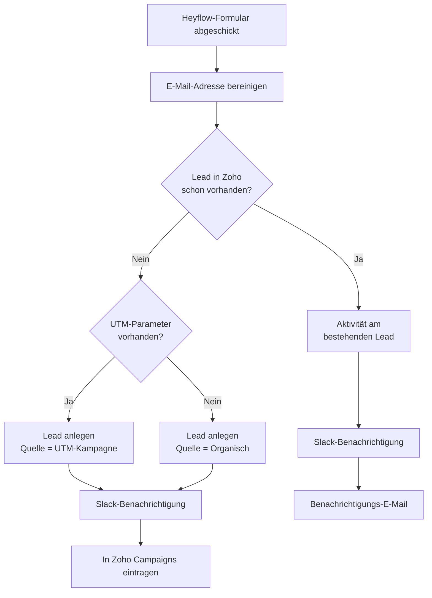

<Callout kind="info">
  **Bereich:** Lead-Intake / Webseite · **Status:** 🟢 Aktiv · **Make-ID:** 1332443
</Callout>

## Verwendete Tools

`Zoho CRM` `Slack` `Zoho Campaigns` `E-Mail`

## In a nutshell

Eine deutschsprachige Webseiten-Anfrage über **Heyflow** wird automatisch zum **Zoho-Lead** — mit Dublettenprüfung, Quellenerkennung (bezahlte Kampagne vs. organisch), **Slack**-Meldung und Eintrag in den **Newsletter**. Testanfragen werden herausgefiltert.

## Ablauf

## Auf einen Blick

| | |
| --- | --- |
| **Auslöser** | Webhook — Formular-Absenden in Heyflow |
| **Häufigkeit** | Sofort bei jeder Anfrage (Echtzeit) |
| **Schreibt nach** | Zoho CRM (Lead), Zoho Campaigns (Newsletter), Slack |
| **Wo zu finden** | [Make-Szenario öffnen ↗](https://eu2.make.com/548585/scenarios/1332443/edit) |

## Im Detail

<Steps>
  <Step title="Anfrage empfangen">
    Heyflow schickt die Formulardaten per Webhook an Make. Die **E-Mail-Adresse wird bereinigt** (Leerzeichen, Groß-/Kleinschreibung).
  </Step>
  <Step title="Dublette prüfen">
    Zoho CRM wird durchsucht, ob mit dieser E-Mail **bereits ein Lead existiert**.
  </Step>
  <Step title="Neuer Lead — Quelle erkennen">
    Existiert noch kein Lead, entscheidet der Flow anhand der **UTM-Parameter**:
    - **UTM vorhanden** → Lead-Quelle = bezahlte Kampagne (UTM-Source)
    - **kein UTM** → Lead-Quelle = Organisch
  </Step>
  <Step title="Anlegen & benachrichtigen">
    Der Lead wird in Zoho angelegt, das Team bekommt eine **Slack-Meldung**, und der Kontakt wird in **Zoho Campaigns** für den Newsletter eingetragen.
  </Step>
  <Step title="Bestehender Lead">
    Existiert der Lead schon, wird statt eines Duplikats eine **Aktivität am bestehenden Lead** vermerkt, Slack benachrichtigt und eine **Hinweis-E-Mail** versendet.
  </Step>
</Steps>

### Daten

| Rein | Raus |
| --- | --- |
| Vorname, Nachname, E-Mail, Unternehmen, Nachricht, UTM-Parameter, gclid | Zoho-Lead (mit Quelle), Newsletter-Kontakt, Slack-Nachricht |

### Wichtige Regeln

<Callout kind="info">
  **Test-Anfragen werden gefiltert:** Enthält Vor-, Nachname, Unternehmen oder E-Mail das Wort „test", wird der Kontakt **nicht** in Zoho Campaigns eingetragen.
</Callout>

### Fehlerfälle

| Symptom | Mögliche Ursache | Erste Maßnahme |
| --- | --- | --- |
| Kein Lead in Zoho nach Anfrage | Webhook nicht ausgelöst oder Zoho-Verbindung abgelaufen | Im Make-Szenario die letzte Ausführung prüfen, Zoho-Connection neu autorisieren |
| Lead doppelt angelegt | Dublettenprüfung greift nicht (z. B. abweichende E-Mail-Schreibweise) | E-Mail-Bereinigung im ersten Schritt prüfen |
| Keine Slack-Meldung | Slack-Verbindung getrennt | Slack-Connection in Make neu verbinden |
| Lead landet nicht im Newsletter | Test-Filter hat gegriffen oder Zoho-Campaigns-Verbindung defekt | Prüfen, ob die Daten „test" enthalten; Verbindung kontrollieren |
