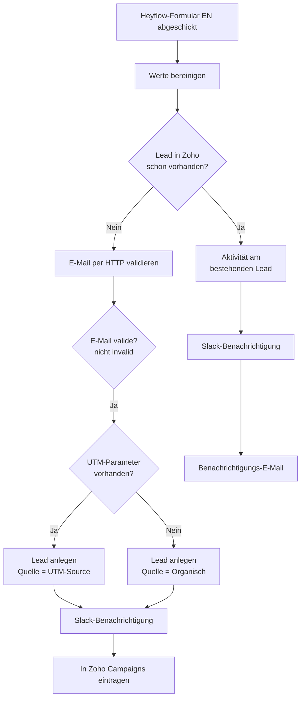

<Callout kind="info">
  **Bereich:** Lead-Intake / Webseite · **Status:** 🟢 Aktiv · **Make-ID:** 1593986
</Callout>

## Zweck

Jede neue **englischsprachige Anfrage** über das Heyflow-Formular auf der Webseite wird automatisch zu einem Lead in Zoho CRM. Der Flow prüft vorher, ob der Lead schon existiert, **validiert die E-Mail-Adresse per HTTP-Dienst**, erkennt die Lead-Quelle (bezahlte Kampagne vs. organisch) und benachrichtigt das Team in Slack.

## Auf einen Blick

| | |
| --- | --- |
| **Auslöser** | Webhook — Formular-Absenden in Heyflow (EN) |
| **Häufigkeit** | Sofort bei jeder Anfrage (Echtzeit) |
| **Verknüpfte Tools** | Zoho CRM, Slack, Zoho Campaigns, HTTP (E-Mail-Validierung), E-Mail |
| **Schreibt nach** | Zoho CRM (Lead), Zoho Campaigns (Newsletter), Slack |
| **Wo zu finden** | [Make-Szenario öffnen ↗](https://eu2.make.com/548585/scenarios/1593986/edit) |

## Ablauf

<Steps>
  <Step title="Anfrage empfangen">
    Heyflow schickt die Formulardaten per Webhook an Make. Anschließend werden die **Werte bereinigt** (Leerzeichen, Groß-/Kleinschreibung).
  </Step>
  <Step title="Dublette prüfen">
    Zoho CRM wird durchsucht, ob mit dieser E-Mail **bereits ein Lead existiert**.
  </Step>
  <Step title="E-Mail validieren">
    Existiert noch kein Lead, wird die **E-Mail-Adresse über einen HTTP-Dienst geprüft**. Nur wenn der Status **nicht „invalid"** ist, geht der Flow weiter.
  </Step>
  <Step title="Neuer Lead — Quelle erkennen">
    Bei valider E-Mail entscheidet der Flow anhand der **UTM-Parameter**:
    - **UTM vorhanden** → Lead-Quelle = bezahlte Kampagne (UTM-Source)
    - **kein UTM** → Lead-Quelle = Organisch
  </Step>
  <Step title="Anlegen & benachrichtigen">
    Der Lead wird in Zoho angelegt, das Team bekommt eine **Slack-Meldung**, und der Kontakt wird in **Zoho Campaigns** für den Newsletter eingetragen.
  </Step>
  <Step title="Bestehender Lead">
    Existiert der Lead schon, wird statt eines Duplikats eine **Aktivität am bestehenden Lead** vermerkt, Slack benachrichtigt und eine **Hinweis-E-Mail** versendet.
  </Step>
</Steps>

## Daten

| Rein | Raus |
| --- | --- |
| Vorname, Nachname, E-Mail, Unternehmen, Nachricht, UTM-Parameter | Zoho-Lead (mit Quelle), Newsletter-Kontakt, Slack-Nachricht |

## Wichtige Regeln

<Callout kind="info">
  **E-Mail-Validierung vor Lead-Anlage:** Neue Leads werden erst angelegt, wenn die E-Mail-Prüfung per HTTP einen Status **ungleich „invalid"** zurückgibt. Adressen, die als invalid erkannt werden, werden nicht in Zoho geschrieben.
</Callout>

## Fehlerfälle

| Symptom | Mögliche Ursache | Erste Maßnahme |
| --- | --- | --- |
| Kein Lead in Zoho nach Anfrage | Webhook nicht ausgelöst, E-Mail als invalid eingestuft oder Zoho-Verbindung abgelaufen | Im Make-Szenario die letzte Ausführung prüfen, E-Mail-Validierungs-Status ansehen, Zoho-Connection neu autorisieren |
| Valide Anfrage wird abgewiesen | E-Mail-Validierungs-Dienst (HTTP) liefert „invalid" oder ist nicht erreichbar | HTTP-Modul-Ausgabe prüfen, Dienst-Status kontrollieren |
| Lead doppelt angelegt | Dublettenprüfung greift nicht (z. B. abweichende E-Mail-Schreibweise) | Werte-Bereinigung im ersten Schritt prüfen |
| Keine Slack-Meldung | Slack-Verbindung getrennt | Slack-Connection in Make neu verbinden |
| Lead landet nicht im Newsletter | Zoho-Campaigns-Verbindung defekt | Verbindung in Make kontrollieren |
