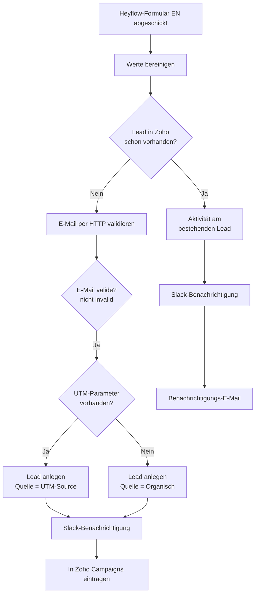

<Callout kind="info">
  **Bereich:** Lead-Intake und Webseite · **Status:** Aktiv · **Make-ID:** 1593986
</Callout>

## Verwendete Tools

`Zoho CRM` `Slack` `Zoho Campaigns` `HTTP` `E-Mail`

## In a nutshell

Schickt jemand das englische **Heyflow**-Formular ab, legt dieser Flow daraus einen **Zoho-Lead** an. Vorher prüft er auf Dubletten, **validiert die E-Mail per HTTP-Dienst**, erkennt die Quelle (bezahlte Kampagne oder organisch) und meldet das Team in **Slack**.

## Ablauf

## Auf einen Blick

- **Auslöser:** Webhook, wenn jemand das englische Heyflow-Formular abschickt
- **Häufigkeit:** Sofort bei jeder Anfrage (Echtzeit)
- **Schreibt nach:** Zoho CRM (Lead), Zoho Campaigns (Newsletter), Slack
- **Wo zu finden:** [Make-Szenario öffnen ↗](https://eu2.make.com/548585/scenarios/1593986/edit)

## Im Detail

<Steps>
  <Step title="Anfrage empfangen">
    Heyflow schickt die Formulardaten per Webhook an Make. Anschließend werden die **Werte bereinigt**, also Leerzeichen entfernt und die Schreibweise vereinheitlicht.
  </Step>
  <Step title="Dublette prüfen">
    Zoho CRM wird durchsucht, ob mit dieser E-Mail **bereits ein Lead existiert**.
  </Step>
  <Step title="E-Mail validieren">
    Existiert noch kein Lead, wird die **E-Mail-Adresse über einen HTTP-Dienst geprüft**. Nur wenn der Status **nicht „invalid"** ist, geht der Flow weiter.
  </Step>
  <Step title="Neuer Lead: Quelle erkennen">
    Bei valider E-Mail entscheidet der Flow anhand der **UTM-Parameter**:
    - **UTM vorhanden** → Lead-Quelle = bezahlte Kampagne (UTM-Source)
    - **kein UTM** → Lead-Quelle = Organisch
  </Step>
  <Step title="Anlegen und benachrichtigen">
    Der Lead wird in Zoho angelegt, das Team bekommt eine **Slack-Meldung**, und der Kontakt wird in **Zoho Campaigns** für den Newsletter eingetragen.
  </Step>
  <Step title="Bestehender Lead">
    Existiert der Lead schon, wird statt eines Duplikats eine **Aktivität am bestehenden Lead** vermerkt, Slack benachrichtigt und ein **Hinweis per E-Mail** versendet.
  </Step>
</Steps>

### Daten

| Rein | Raus |
| --- | --- |
| Vorname, Nachname, E-Mail, Unternehmen, Nachricht, UTM-Parameter | Zoho-Lead (mit Quelle), Newsletter-Kontakt, Slack-Nachricht |

### Wichtige Regeln

<Callout kind="info">
  **E-Mail wird vor der Lead-Anlage validiert:** Neue Leads werden erst angelegt, wenn die Prüfung der E-Mail per HTTP einen Status **ungleich „invalid"** zurückgibt. Adressen, die als invalid erkannt werden, werden nicht in Zoho geschrieben.
</Callout>

### Fehlerfälle

| Symptom | Mögliche Ursache | Erste Maßnahme |
| --- | --- | --- |
| Kein Lead in Zoho nach Anfrage | Webhook nicht ausgelöst, E-Mail als invalid eingestuft oder Zoho-Verbindung abgelaufen | Im Make-Szenario die letzte Ausführung prüfen, den Status der E-Mail-Prüfung ansehen, Zoho-Connection neu autorisieren |
| Valide Anfrage wird abgewiesen | Der HTTP-Dienst zur E-Mail-Prüfung liefert „invalid" oder ist nicht erreichbar | HTTP-Modul-Ausgabe prüfen und den Status des Dienstes kontrollieren |
| Lead doppelt angelegt | Dublettenprüfung greift nicht (z. B. abweichende E-Mail-Schreibweise) | Prüfen, ob die Werte im ersten Schritt sauber bereinigt werden |
| Keine Slack-Meldung | Slack-Verbindung getrennt | Slack-Connection in Make neu verbinden |
| Lead landet nicht im Newsletter | Verbindung zu Zoho Campaigns defekt | Verbindung in Make kontrollieren |
