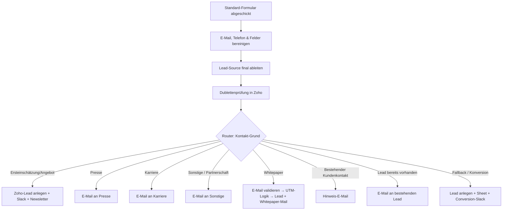

<Callout kind="info">
  **Bereich:** Lead-Intake / Webseite · **Status:** 🟢 Aktiv · **Make-ID:** 1511715
</Callout>

## Zweck

Das **Standard-Kontaktformular** der Webseite kann für viele Anliegen genutzt werden. Dieser Flow **sortiert jede Anfrage nach dem angegebenen Kontakt-Grund** und steuert sie in den richtigen Pfad — von der Lead-Anlage in Zoho CRM über Presse-, Karriere- und Whitepaper-Anfragen bis zu bestehenden Kundenkontakten. Inklusive E-Mail-Validierung, UTM-Logik und Slack-Meldung.

## Auf einen Blick

| | |
| --- | --- |
| **Auslöser** | Webhook — Standard-Formular der Webseite |
| **Häufigkeit** | Sofort bei jeder Anfrage (Echtzeit) |
| **Verknüpfte Tools** | Zoho CRM, Zoho Campaigns, Slack, HTTP (E-Mail-Validierung), Google Sheets, E-Mail |
| **Schreibt nach** | Zoho CRM (Lead), Zoho Campaigns (Newsletter), Slack, Google Sheets, E-Mail |
| **Wo zu finden** | [Make-Szenario öffnen ↗](https://eu2.make.com/548585/scenarios/1511715/edit) |

## Ablauf

Dies ist mit **59 Modulen** der größte Webseiten-Flow. Das Diagramm zeigt den Hauptpfad und die acht Router-Zweige nach Kontakt-Grund; einzelne Zweige (z. B. Whitepaper) verzweigen intern nochmals über E-Mail-Validierung und UTM-Logik.

<Steps>
  <Step title="Anfrage empfangen & bereinigen">
    Der Webhook empfängt die Formulardaten. Anschließend werden **E-Mail, Telefonnummer, Unternehmen und Nachricht bereinigt**: Anführungszeichen entfernt, Zeilenumbrüche normalisiert und die Nachricht auf **200 Zeichen** gekürzt.
  </Step>
  <Step title="Lead-Source ableiten">
    Der Flow setzt die finale **Lead-Source** und prüft per Dublettensuche in Zoho, ob der Lead bereits existiert.
  </Step>
  <Step title="Nach Kontakt-Grund sortieren">
    Der zentrale **8-Wege-Router** verzweigt je nach „Kontakt-Grund":
    - **Ersteinschätzung/Angebot** → Lead in Zoho anlegen, Lead-Source (E-Büro oder Webseite) setzen, Slack-Meldung, Hinweis-E-Mail und Newsletter-Eintrag
    - **Presse** → E-Mail an die Presse-Adresse
    - **Karriere** → E-Mail an die Karriere-Adresse
    - **Sonstige / Partnerschaft** → E-Mail an die Sammeladresse
    - **Whitepaper** → eigener Validierungs- und UTM-Pfad (siehe nächster Schritt)
    - **Bestehender Kundenkontakt** → Hinweis-E-Mail
    - **Lead bereits vorhanden** → E-Mail an den bestehenden Lead
    - **Fallback / Konversion** → Lead anlegen, in Google Sheets speichern, Conversion-Meldung in Slack
  </Step>
  <Step title="Whitepaper-Pfad mit E-Mail-Validierung">
    Bei Whitepaper-Anfragen prüft der Flow zuerst die **E-Mail-Gültigkeit** (Status safe, catch_all, role_account oder unknown). Danach verzweigt er nach **UTM-Parametern**:
    - **UTM vorhanden** → Lead mit Kampagnen-Quelle (Update oder Neu-Anlage als Fallback)
    - **kein UTM** → Lead als Organisch (Update oder Neu-Anlage)

    In beiden Fällen folgen Hinweis-E-Mail, Slack-Meldung und Newsletter-Eintrag.
  </Step>
  <Step title="Konversion & Spreadsheet">
    Für bestimmte Formulare (z. B. „Form-LPG", Ludwig-Erhard-Gipfel) wird der Lead zusätzlich in ein **Google Sheet** geschrieben und eine **Conversion-Nachricht** in Slack gepostet.
  </Step>
</Steps>

## Daten

| Rein | Raus |
| --- | --- |
| Vorname, Nachname, E-Mail, Telefonnummer, Unternehmen, Nachricht, Kontakt-Grund (DE/EN), UTM-Parameter, Formular-Name | Zoho-Lead (mit Quelle), Newsletter-Kontakt, Slack-Nachrichten, Google-Sheets-Zeile, themenspezifische E-Mails |

## Wichtige Regeln

<Callout kind="info">
  **Nachricht auf 200 Zeichen begrenzt:** Lange Freitexte werden vor der Lead-Anlage gekürzt, Anführungszeichen und Zeilenumbrüche normalisiert.
</Callout>

<Callout kind="info">
  **Test-Anfragen werden gefiltert:** Enthält Vor-, Nachname, Unternehmen, Nachricht oder E-Mail das Wort „test" — oder handelt es sich um eine „eBuero-Telefonanfrage" — wird der Kontakt **nicht** in Zoho Campaigns eingetragen und keine Slack-Meldung verschickt.
</Callout>

<Callout kind="info">
  **E-Mail-Validierung im Whitepaper-Pfad:** Whitepaper-Leads werden nur weiterverarbeitet, wenn der Validierungs-Status safe, catch_all, role_account oder unknown ist.
</Callout>

## Fehlerfälle

| Symptom | Mögliche Ursache | Erste Maßnahme |
| --- | --- | --- |
| Anfrage landet im falschen Zweig | Kontakt-Grund weicht vom erwarteten Wert ab (DE/EN-Schreibweise) | Router-Filter im Make-Szenario gegen den eingehenden „Kontakt Grund Neu" prüfen |
| Kein Lead in Zoho | E-Mail als invalid eingestuft, Test-Filter griff oder Zoho-Verbindung abgelaufen | Letzte Ausführung prüfen, Validierungs-Status ansehen, Zoho-Connection neu autorisieren |
| Whitepaper-Lead fehlt | E-Mail-Validierung (HTTP) lieferte invalid oder Dienst nicht erreichbar | HTTP-Modul-Ausgabe und Status-Filter kontrollieren |
| Keine Presse-/Karriere-E-Mail | E-Mail-Verbindung getrennt oder Filterbedingung nicht erfüllt | E-Mail-Connection prüfen, Kontakt-Grund-Wert kontrollieren |
| Lead fehlt im Spreadsheet | Formular-Name passt nicht zum Filter (z. B. „Form-LPG") | Filterbedingung für das jeweilige Formular prüfen |
| Keine Slack-Meldung | Slack-Verbindung getrennt oder Test-Filter griff | Slack-Connection neu verbinden, auf „test" in den Daten prüfen |
