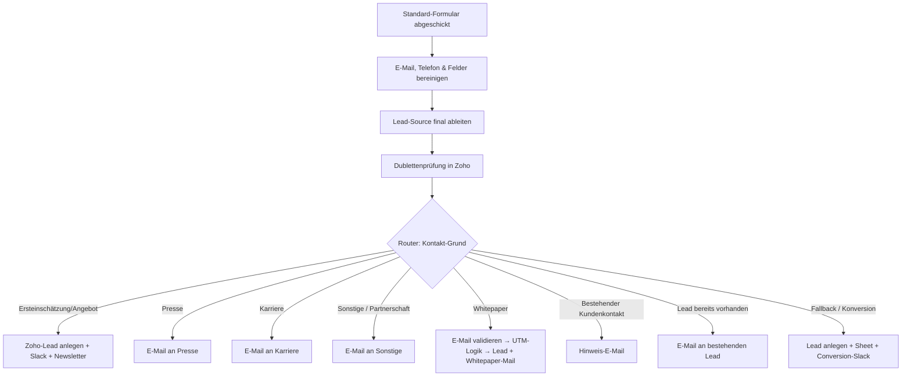

<Callout kind="info">
  **Bereich:** Lead-Intake und Webseite · **Status:** Aktiv · **Make-ID:** 1511715
</Callout>

## Verwendete Tools

`Zoho CRM` `Zoho Campaigns` `Slack` `HTTP` `Google Sheets` `E-Mail`

## In a nutshell

Über das **Standard-Kontaktformular** der Webseite kommen viele verschiedene Anliegen rein. Dieser Flow **sortiert jede Anfrage nach dem Kontakt-Grund** und schickt sie in den richtigen Pfad: Lead-Anlage in **Zoho CRM**, Presse, Karriere, Whitepaper oder bestehender Kundenkontakt. Dazu validiert er die E-Mail, wertet UTM-Parameter aus und meldet in **Slack**.

## Ablauf

Dies ist mit **59 Modulen** der größte Flow der Webseite. Das Diagramm zeigt den Hauptpfad und die acht Router-Zweige nach Kontakt-Grund. Einzelne Zweige wie etwa Whitepaper verzweigen intern nochmals, prüfen die E-Mail und werten die UTM-Logik aus.

## Auf einen Blick

- **Auslöser:** Webhook vom Standard-Formular der Webseite
- **Häufigkeit:** Sofort bei jeder Anfrage (Echtzeit)
- **Schreibt nach:** Zoho CRM (Lead), Zoho Campaigns (Newsletter), Slack, Google Sheets, E-Mail
- **Wo zu finden:** [Make-Szenario öffnen ↗](https://eu2.make.com/548585/scenarios/1511715/edit)

## Im Detail

<Steps>
  <Step title="Anfrage empfangen und bereinigen">
    Der Webhook empfängt die Formulardaten. Anschließend werden **E-Mail, Telefonnummer, Unternehmen und Nachricht bereinigt**: Anführungszeichen entfernt, Zeilenumbrüche normalisiert und die Nachricht auf **200 Zeichen** gekürzt.
  </Step>
  <Step title="Lead-Source ableiten">
    Der Flow setzt die finale **Lead-Source** und prüft per Dublettensuche in Zoho, ob der Lead bereits existiert.
  </Step>
  <Step title="Nach Kontakt-Grund sortieren">
    Der zentrale **Router mit acht Wegen** verzweigt je nach „Kontakt-Grund":
    - **Ersteinschätzung oder Angebot** → Lead in Zoho anlegen, Lead-Source (E-Büro oder Webseite) setzen, Slack-Meldung, einen Hinweis per E-Mail und Newsletter-Eintrag
    - **Presse** → E-Mail an die Presse-Adresse
    - **Karriere** → E-Mail an die Karriere-Adresse
    - **Sonstige oder Partnerschaft** → E-Mail an die Sammeladresse
    - **Whitepaper** → eigener Pfad, der die E-Mail prüft und die UTM-Parameter auswertet (siehe nächster Schritt)
    - **Bestehender Kundenkontakt** → einen Hinweis per E-Mail
    - **Lead bereits vorhanden** → E-Mail an den bestehenden Lead
    - **Fallback oder Konversion** → Lead anlegen, in Google Sheets speichern, Conversion-Meldung in Slack
  </Step>
  <Step title="Whitepaper-Pfad mit Prüfung der E-Mail">
    Bei Whitepaper-Anfragen prüft der Flow zuerst, ob die **E-Mail gültig** ist (Status safe, catch_all, role_account oder unknown). Danach verzweigt er nach **UTM-Parametern**:
    - **UTM vorhanden** → Lead mit Kampagnen-Quelle (Update oder neu anlegen als Fallback)
    - **kein UTM** → Lead als Organisch (Update oder neu anlegen)

    In beiden Fällen folgen ein Hinweis per E-Mail, eine Slack-Meldung und der Newsletter-Eintrag.
  </Step>
  <Step title="Konversion und Spreadsheet">
    Für bestimmte Formulare (z. B. „Form-LPG", Ludwig-Erhard-Gipfel) wird der Lead zusätzlich in ein **Google Sheet** geschrieben und eine **Conversion-Nachricht** in Slack gepostet.
  </Step>
</Steps>

### Daten

| Rein | Raus |
| --- | --- |
| Vorname, Nachname, E-Mail, Telefonnummer, Unternehmen, Nachricht, Kontakt-Grund (deutsch oder englisch), UTM-Parameter, Formular-Name | Zoho-Lead (mit Quelle), Newsletter-Kontakt, Slack-Nachrichten, Zeile im Google Sheet, themenspezifische E-Mails |

### Wichtige Regeln

<Callout kind="info">
  **Nachricht auf 200 Zeichen begrenzt:** Lange Freitexte werden vor der Lead-Anlage gekürzt, Anführungszeichen und Zeilenumbrüche normalisiert.
</Callout>

<Callout kind="info">
  **Testanfragen werden gefiltert:** Enthält Vorname, Nachname, Unternehmen, Nachricht oder E-Mail das Wort „test", oder handelt es sich um eine „eBuero-Telefonanfrage", wird der Kontakt **nicht** in Zoho Campaigns eingetragen und keine Slack-Meldung verschickt.
</Callout>

<Callout kind="info">
  **E-Mail-Prüfung im Whitepaper-Pfad:** Whitepaper-Leads werden nur weiterverarbeitet, wenn der Status der Prüfung safe, catch_all, role_account oder unknown ist.
</Callout>

### Fehlerfälle

| Symptom | Mögliche Ursache | Erste Maßnahme |
| --- | --- | --- |
| Anfrage landet im falschen Zweig | Kontakt-Grund weicht vom erwarteten Wert ab (deutsche oder englische Schreibweise) | Router-Filter im Make-Szenario gegen den eingehenden „Kontakt Grund Neu" prüfen |
| Kein Lead in Zoho | E-Mail als invalid eingestuft, Testfilter griff oder Zoho-Verbindung abgelaufen | Letzte Ausführung prüfen, den Status der Prüfung ansehen, Zoho-Connection neu autorisieren |
| Whitepaper-Lead fehlt | Die Prüfung der E-Mail per HTTP lieferte invalid oder der Dienst war nicht erreichbar | HTTP-Modul-Ausgabe und den Filter auf den Status kontrollieren |
| Keine E-Mail an Presse oder Karriere | E-Mail-Verbindung getrennt oder Filterbedingung nicht erfüllt | E-Mail-Connection prüfen und den Wert des Kontakt-Grunds kontrollieren |
| Lead fehlt im Spreadsheet | Formular-Name passt nicht zum Filter (z. B. „Form-LPG") | Filterbedingung für das jeweilige Formular prüfen |
| Keine Slack-Meldung | Slack-Verbindung getrennt oder Testfilter griff | Slack-Connection neu verbinden und auf „test" in den Daten prüfen |
