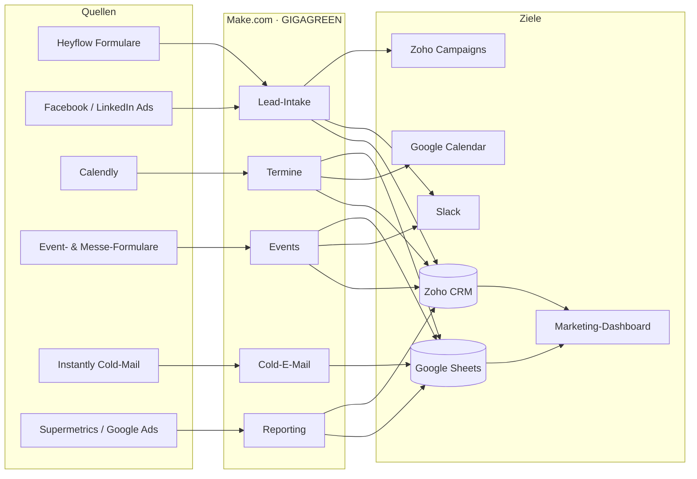

## Datenflüsse im Überblick

Die Grafik zeigt, woher Daten kommen (Quellen), welche Automations-Bereiche sie verarbeiten und wo sie landen. Im Zentrum steht fast immer **Zoho CRM** als führendes System.

## Die Flows nach Bereich

| Bereich | Flows | Kurzbeschreibung |
| --- | --- | --- |
| **Lead-Intake und Webseite** | 6 | Formulare auf der Webseite und in Ads → Zoho-Lead, Slack-Meldung, Newsletter. Inklusive Dublettenprüfung, UTM-Quellenerkennung und Test-Lead-Filter. |
| **Termine und Calendly** | 4 | Calendly-Buchungen → Zoho-Meeting, AE-Kalender und SQL-Liste. Stornos löschen frische Fehl-Leads, No-Shows werden markiert. |
| **Events** | 4 | Formulare für Messen und Events legen Kontakte, Accounts, Opportunities und Notizen in Zoho an. Zusagen und Absagen werden als Notiz verbucht und in Slack gemeldet. |
| **Reporting und Dashboard** | 8 | Sammelt Kosten, Klicks und Kampagnen-KPIs, dedupliziert Lead-Listen und lädt SQL-Conversions zu Google Ads hoch. Bildet die Datenbasis fürs Dashboard. |
| **Cold Mail und Outreach** | 1 | Negative Antworten aus Instantly werden an den zuständigen Kollegen weitergeleitet und protokolliert. |
| **Sonstiges** | 1 | Wiederkehrende Erinnerungs-E-Mail zur Pflege der Kosten von Yoyaba und AddSales. |
