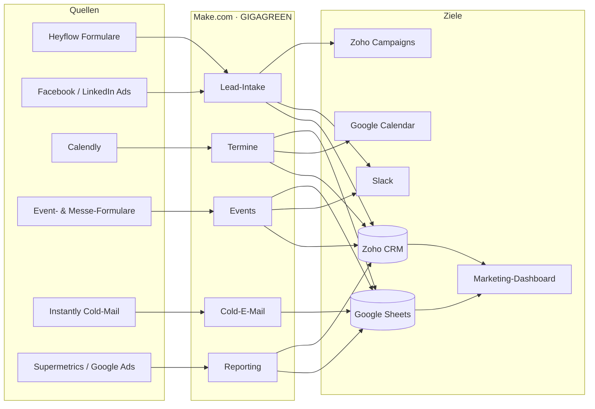

## Datenflüsse im Überblick

Die Grafik zeigt, woher Daten kommen (Quellen), welche Automations-Bereiche sie verarbeiten und wo sie landen. Im Zentrum steht fast immer **Zoho CRM** als führendes System.

## Die Flows nach Bereich

<AccordionGroup>
  <Accordion title="Lead-Intake / Webseite (6 Flows)" icon="globe">
    Webseiten- und Ad-Formulare → Zoho-Lead, Slack-Meldung, Newsletter. Inkl. Dublettenprüfung, UTM-Quellenerkennung und Test-Lead-Filter.
  </Accordion>
  <Accordion title="Termine / Calendly (4 Flows)" icon="calendar">
    Calendly-Buchungen → Zoho-Meeting + AE-Kalender + SQL-Liste. Stornos löschen frische Fehl-Leads, No-Shows werden markiert.
  </Accordion>
  <Accordion title="Events (4 Flows)" icon="ticket">
    Messe-/Event-Formulare legen Kontakte, Accounts, Opportunities und Notizen in Zoho an; Zu-/Absagen werden als Notiz verbucht und in Slack gemeldet.
  </Accordion>
  <Accordion title="Reporting / Dashboard (8 Flows)" icon="chart-line">
    Sammelt Kosten, Klicks, Kampagnen-KPIs, dedupliziert Lead-Listen und lädt SQL-Conversions zu Google Ads hoch — Datenbasis fürs Dashboard.
  </Accordion>
  <Accordion title="Cold-E-Mail & Outreach (1 Flow)" icon="mail">
    Negative Antworten aus Instantly werden an den zuständigen Kollegen weitergeleitet und protokolliert.
  </Accordion>
  <Accordion title="Sonstiges (1 Flow)" icon="bell">
    Wiederkehrende Erinnerungs-E-Mail zur Pflege der Yoyaba- und AddSales-Kosten.
  </Accordion>
</AccordionGroup>
